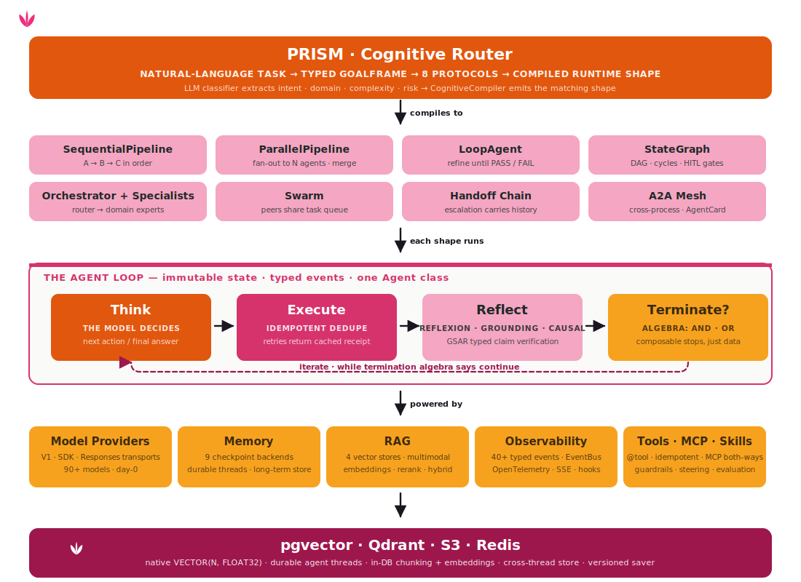

<p align="center">
  
</p>

<p align="center">
  <strong>Tulip — the safest way to build agentic AI.</strong><br>
  <em>An open-source, full-stack agent SDK. Build agents the usual way — tools, memory,
  multi-agent, RAG — on a runtime where control is native: the <a href="https://tulipagents.ai/concepts/router/">cognitive router</a> picks the
  right shape for the task, <a href="https://tulipagents.ai/concepts/gsar/">GSAR</a> grounds every claim (or makes the agent abstain), and the
  admission gate lets a consequential action run only after it clears a policy you write —
  pausing for a human when the stakes are high and landing on a tamper-evident audit trail.
  Safe by construction, not by reminder.</em>
</p>

<p align="center">
  <a href="https://pypi.org/project/tulip-agents/"></a>
  
  <a href="https://www.apache.org/licenses/LICENSE-2.0"></a>
  
  
</p>

<p align="center">
  <strong>OpenAI · Anthropic · bring your own</strong><br>
  <em>A model is one string. The loop, the tools, and the event stream stay put.</em>
</p>

<p align="center">
  <a href="https://tulipagents.ai/why-tulip/">Why Tulip</a> ·
  <a href="https://tulipagents.ai/concepts/router/">Cognitive router</a> ·
  <a href="https://tulipagents.ai/concepts/gsar/">GSAR grounding</a> ·
  <a href="https://tulipagents.ai/concepts/security/">Admission gate</a> ·
  <a href="https://tulipagents.ai/notebooks/">Notebooks</a> ·
  <a href="https://tulipagents.ai/workbench/">Workbench</a>
</p>

<p align="center">
  <strong>Try every Tulip pattern in your browser →</strong>
  <a href="https://tulipagents.ai/workbench/"><strong>Workbench guide</strong></a><br>
  <em>A browser playground for every pattern — run it on localhost in three terminals, or in
  a single Docker container. Bring your own OpenAI / Anthropic key.</em>
</p>

---

## Build an agent

A model is a string, a tool is a function, and `run_sync` runs the loop. That's the whole
surface for your first agent.

```python
from tulip import Agent, tool

@tool
def search_flights(origin: str, destination: str, date: str) -> list[dict]:
    """Find available flights between two cities on a given date."""
    return flights.search(origin, destination, date)

agent = Agent(
    model="anthropic:claude-sonnet-4-6",          # swap providers with one string
    tools=[search_flights],
    system_prompt="You are a travel assistant. Be concise and cite prices.",
)

print(agent.run_sync("Cheapest flight from Lisbon to Berlin next Friday?").text)
```

Behind the scenes the agent alternates reasoning with tool calls until it can answer.
Construction, the model call, retries, and the reply all live behind that one `Agent` class
— point `model=` at `"openai:gpt-4o"` and nothing else moves.

```bash
pip install "tulip-agents[anthropic]"     # or [openai], or [sdk] for everything
```

No mandatory cloud account to start — a bundled `MockModel` lets every notebook run offline.

---

## What is Tulip?

**Tulip is a complete, open-source agentic framework — and the safest one to build on.**
You get everything you'd expect: one `Agent` class, tools, durable memory, RAG, eight
multi-agent shapes, streaming, and a typed event stream. What makes it *safe* is that
control isn't a guardrail you remember to add — it's wired through three points in the core:

- **The router controls *which shape* runs.** Describe a task in plain language; the
  **[PRISM cognitive router](https://tulipagents.ai/concepts/router/)** fills a typed `GoalFrame` and a **deterministic** picker
  compiles it to the right runtime shape. The model classifies — it never authors the
  topology.
- **[GSAR](https://tulipagents.ai/concepts/gsar/) controls *what gets asserted*.** Every claim is partitioned grounded / ungrounded
  / contradicted / unknown against typed evidence. Below threshold the agent regenerates,
  replans, or **abstains** — an ungrounded claim is a false result *by construction* and
  never ships.
- **The admission gate controls *what actions fire*.** A consequential action — issue a
  refund, ship a deploy, change an account, isolate a host — runs only after it clears
  `admit()`: a policy check *outside the model*, held for a human when the stakes warrant,
  recorded on a tamper-evident trail either way.

> **You can fool the model; you can't talk past the gate.** The admission check is real code,
> outside the model — so even a jailbroken or misled agent can't fire a side-effecting call
> your policy denies. Try it:
> [`examples/can_you_make_it_go_rogue.py`](examples/can_you_make_it_go_rogue.py).

Frontier models are brilliant, and getting more so. The one thing a model *structurally
cannot do* — no matter how smart — is **prove it won't take a catastrophic action.** That's
not an intelligence problem; it's a control problem, and control is the layer Tulip owns.

## See it in 60 seconds

| Run | What it shows |
|-----|---------------|
| [`examples/notebook_06_basic_agent.py`](examples/notebook_06_basic_agent.py) | Your first agent — one `Agent`, one tool, the run loop. |
| [`examples/notebook_58_cognitive_router.py`](examples/notebook_58_cognitive_router.py) | One natural-language task → the router compiles the right shape. |
| [`examples/can_you_make_it_go_rogue.py`](examples/can_you_make_it_go_rogue.py) | Jailbreak an agent with live prod tools — the admission gate blocks the action anyway. 🏆 breaches: 0. |

## Add a tool

A tool is an ordinary Python function — `@tool` publishes its signature and docstring so the
model knows when to reach for it.

```python
from tulip import Agent, tool

@tool
def order_status(order_id: str) -> str:
    """Look up the current status of a customer order."""
    return orders.get(order_id)

agent = Agent(
    model="openai:gpt-4o",
    tools=[order_status],
    system_prompt="You are a helpful support assistant. Be concise.",
)

print(agent.run_sync("Where's my order ord-4821?").text)
```

For tools where a duplicate call would hurt — moving money, paging an on-call, filing a
ticket — declare `@tool(idempotent=True)`: the loop keys every invocation on `(name, args)`
and refuses to fire the same one twice, even across retries.

---

## Talk to any provider

A model is a string. The prefix before the colon (`openai:`, `anthropic:`) tells the SDK
which provider to use; the rest is the model id that provider expects. `get_model()` parses
the string and returns a ready client.

```python
Agent(model="openai:gpt-4o")                     # OpenAI direct
Agent(model="anthropic:claude-sonnet-4-6")       # Anthropic direct
```

| Provider | Class | What it covers |
|---|---|---|
| **OpenAI** | `OpenAIModel` | Chat completions, reasoning models (o-series), `base_url` override for Azure · Portkey · LiteLLM · vLLM · together.ai · fireworks · groq |
| **Anthropic** | `AnthropicModel` | Claude family with prompt caching + extended thinking |
| **Custom** | `register_provider("myco", MyModel)` | Implement `ModelProtocol` — `complete` · `stream` (~50 lines) |

Because OpenAI-compatible endpoints accept a `base_url`, `OpenAIModel` also fronts gateways
and self-hosted servers (LiteLLM, vLLM, Azure OpenAI, together.ai, groq, …) without a
dedicated provider.

→ [Model providers concept page](https://tulipagents.ai/concepts/models/)

---

## The cognitive router (PRISM) — describe what you need, get the right shape

Once you know agents, the next step is knowing *which* shape to use. The cognitive router
takes a natural-language task, runs an LLM classifier that fills a typed `GoalFrame` (intent
· domain · complexity · risk), matches it to one of eight built-in coordination protocols,
and the `CognitiveCompiler` emits the matching runtime primitive — without you hand-coding
the topology. **The model classifies; routing is deterministic.**

```python
from tulip import Agent
from tulip.models import get_model
from tulip.router import (
    CapabilityIndex, CognitiveCompiler, GoalFrame, PolicyGate,
    ProtocolRegistry, Router, SkillIndex, builtin_protocols,
)
from tulip.tools.registry import create_registry

registry = create_registry(kb_search, get_metric, list_alerts)

protocols = ProtocolRegistry()
for p in builtin_protocols():
    protocols.register(p)

router = Router(
    frame_extractor=Agent(model=get_model(), output_schema=GoalFrame),
    protocols=protocols,
    capabilities=CapabilityIndex(registry),
    skills=SkillIndex(),
    gate=PolicyGate(),
    compiler=CognitiveCompiler(),
)

result = await router.dispatch(
    "We just got a sev-1 latency alert on the checkout service. "
    "Investigate and recommend remediation."
)
print(f"protocol={result.protocol_id}")
print(result.text)
```

The same `router.dispatch(...)` resolves a one-shot lookup to a single `Agent`, a multi-step
investigation to a `SequentialPipeline` of planner→executor→validator, and a write-affecting
action to an approval-gated agent — chosen by protocol selection, not by the model.

| Protocol | Compiled shape | Best for |
|---|---|---|
| `direct_response` | Single `Agent` | `ANSWER`, `EXPLAIN` |
| `plan_execute_validate` | `SequentialPipeline` (planner → executor → validator) | `PLAN`, `BUILD`, `MODIFY` |
| `specialist_fanout` | `ParallelPipeline` of N tool-bound Agents | `DIAGNOSE`, `MONITOR` |
| `debate` | Two debaters + judge `Agent` | `COMPARE` |
| `codegen_test_validate` | `LoopAgent` (stops on `PASS`) | `GENERATE_CODE` |
| `approval_gated_execution` | `Agent` wrapped in approval interrupt | `ESCALATE`, `REMEDIATE` |
| `handoff_chain` | `SequentialPipeline` of one-tool Agents | `COORDINATE` |
| `a2a_delegate` | Cross-process A2A call (opt-in) | distributed meshes |

→ [Cognitive router concept](https://tulipagents.ai/concepts/router/)

---

## Every shape for building multi-agent workflows

When one agent isn't enough, Tulip ships **every orchestration shape as a first-class
primitive** — so you can build any multi-agent workflow without leaving the framework:
sequential pipeline, parallel fan-out, refinement loop, explicit state graph, orchestrator +
specialists, swarm, handoff chain, and a cross-process A2A mesh. They all use the same
`Agent` class and the same event stream — outgrow one pattern and the next is already here,
no dropping to a lower-level library.

| Pattern | When to use |
|---|---|
| **SequentialPipeline** | A → B → C in order; each output feeds the next |
| **ParallelPipeline** | Fan out to N agents simultaneously, merge results |
| **LoopAgent** | Refine until a condition fires (PASS/FAIL, confidence, iteration cap) |
| **Orchestrator + Specialists** | One coordinator routes to domain experts in parallel |
| **Swarm** | Open-ended work; peers share a task queue and context |
| **Handoff** | Escalation desk; conversation moves with full history to the next specialist |
| **StateGraph** | Explicit DAG with conditional edges, cycles, and human-in-the-loop gates |
| **A2A** | Cross-process meshes over HTTP; agents advertise capabilities via AgentCard |

```python
from tulip.agent import Agent, SequentialPipeline

draft    = Agent(model=model, system_prompt="Draft a first answer from the request.")
check    = Agent(model=model, system_prompt="Find weaknesses; cite what's missing.")
finalize = Agent(model=model, system_prompt="Write the final answer, addressing the gaps.")

result = await SequentialPipeline(agents=[draft, check, finalize]).run(
    "Summarize the trade-offs of moving the checkout service to a queue."
)
print(result.text)
```

→ [All patterns](https://tulipagents.ai/concepts/multi-agent/)

---

## Grounded by construction (GSAR)

An agent that *acts* must not assert what it can't back up. Tulip's GSAR layer
([paper](https://arxiv.org/abs/2604.23366)) partitions every claim — **grounded / ungrounded
/ contradicted / unknown** — against typed evidence, where tool output outranks inference
and inference outranks domain priors. Below threshold the run **regenerates, replans, or
abstains**. There is no public constructor that emits a grounded result without a score, so
an ungrounded claim is unshippable *by construction* — not filtered after the fact.

```python
from tulip.reasoning.gsar import Claim, EvidenceType, Partition
from tulip.security import ground_finding, Severity, is_finding

result = ground_finding(
    title="Expired TLS certificate on 192.0.2.10:443",
    description="Serving endpoint presents an expired certificate.",
    severity=Severity.HIGH,
    asset="192.0.2.10:443",
    remediation="Rotate the certificate; enforce automated renewal.",
    partition=Partition(grounded=[
        Claim(text="cert expired 2026-05-30", type=EvidenceType.TOOL_MATCH,
              evidence_refs=["tool:tls_scan:not_after=2026-05-30"]),
    ]),
)
# A grounded partition → a typed result. An ungrounded one → an auditable
# Abstention with the reason it was withheld. There is no third path.
print(result.title if is_finding(result) else f"withheld: {result.reason}")
```

Grounding is what makes an agent safe to let *act* anywhere claims drive consequences — it is
sharpest in security (below), but the contract is domain-neutral.

→ [GSAR grounding](https://tulipagents.ai/concepts/gsar/)

---

## The admission gate — an action runs only if policy allows

The moment an agent stops advising and starts **acting** — moving money, deleting a
resource, disabling an account — a wrong step stops being a bad sentence and becomes a real
consequence. A rule in the prompt is advisory by definition; a jailbreak, an injected
document, or a confused chain talks the model past it. Tulip makes the rule **structural**:
the side-effecting call runs only after it clears `admit()`, a gate the model has no way to
reach around.

```python
from tulip.control import Action, AuditTrail, ControlPolicy, admit, AdmissionError

policy = ControlPolicy(require_human_for={"production"})
trail = AuditTrail()

async def safe_refund(order_id: str, usd: float):
    try:
        return await admit(
            Action(name="refund", asset=order_id, kind="payment", environment="production"),
            lambda: payments.refund(order_id, usd),     # your code — any agent loop
            policy=policy, trail=trail,
        )
    except AdmissionError as e:
        notify_oncall(e.decision)                       # the gate held it; the trail has it
```

Production payments now require a human, the attempt is recorded whether it ran or not, and
your agent keeps working unchanged. The chain is short and every link is real:

`action → policy → approval → admission → audit`

- **Policy + approval** — `approve()` weighs your `ControlPolicy` (blast radius,
  `require_human_for`, and — when you have it — a grounding/verification score) and returns
  allow, hold, or deny.
- **Admission** — `admit()` runs the action **only if** approval allows, recording the
  decision to the `AuditTrail`; otherwise it raises `AdmissionError`. The model never touches
  this step.
- **Audit** — the trail is hash-chained, so `verify()` catches any edit after the fact. (It's
  a keyless in-memory SHA-256 chain: tamper-evident, not notarized — add signing or an
  external anchor before treating it as legally authoritative.)

Human approvals are durable: `require_human_for` pauses the run, and an `interrupt()` +
checkpointer means the decision survives a restart and the run resumes where it left off.

→ [The admission gate](https://tulipagents.ai/concepts/security/)

---

## What you get

| | |
|---|---|
| **[🧭 Cognitive router](https://tulipagents.ai/concepts/router/)** | Describe a task → eight named protocols → the right primitive compiled automatically. The LLM fills a typed schema; routing is deterministic. |
| **[🤝 Multi-agent](https://tulipagents.ai/concepts/multi-agent/)** | Seven native patterns + cross-process A2A. One `Agent` class. One event stream. |
| **[🛡 Admission gate](https://tulipagents.ai/concepts/security/)** | `admit()` / `approve()` run a consequential action only if your `ControlPolicy` allows — else hold for a human or deny, recorded either way. |
| **[🧠 GSAR grounding](https://tulipagents.ai/concepts/gsar/)** | Claims partitioned grounded / ungrounded / contradicted / unknown; below threshold the agent regenerates, replans, or abstains. `arXiv:2604.23366`. |
| **[🔬 DeepAgent](https://tulipagents.ai/concepts/deepagent/)** | `create_deepagent` (single agent, per-turn grounding) and `create_research_workflow` (StateGraph with post-hoc grounding eval + two-level recovery). |
| **[📡 Observability](https://tulipagents.ai/concepts/observability/)** | Opt-in `EventBus` — one `run_context()` streams 40+ canonical events from every layer, no external broker. `TelemetryHook` for OpenTelemetry/OTLP. |
| **[🛡 Idempotent tools](https://tulipagents.ai/concepts/idempotency/)** | `@tool(idempotent=True)` — dedupes on `(name, args)`. The model can't double-charge, double-book, or double-page. |
| **[💾 Durable memory](https://tulipagents.ai/concepts/checkpointers/)** | 8 checkpoint backends — PostgreSQL · MySQL · Redis · OpenSearch · S3 / MinIO / R2 · in-memory · file · HTTP. |
| **[🧠 Long-term memory](https://tulipagents.ai/concepts/memory-manager/)** | `Mem0MemoryManager` over [`mem0`](https://github.com/mem0ai/mem0). Portable path: `LLMMemoryManager` over any `BaseStore` (InMemory / Redis / Postgres / OpenSearch). |
| **[🔎 RAG](https://tulipagents.ai/concepts/rag/)** | 5 vector stores — pgvector · Qdrant · Chroma · OpenSearch · in-memory. OpenAI + Cohere embeddings · local + Cohere rerankers · multimodal (PDF, image OCR, audio). |
| **[📡 Streaming + Server](https://tulipagents.ai/concepts/server/)** | Typed events · SSE · `AgentServer` (FastAPI, single shared-key bearer auth, thread persistence). |
| **[🪝 Hooks](https://tulipagents.ai/concepts/hooks/)** | Logging · OpenTelemetry · ModelRetry · Guardrails · Steering (LLM-as-judge). |
| **[🪙 MCP](https://tulipagents.ai/concepts/mcp/)** | `MCPClient` consumes MCP servers. `TulipMCPServer` exposes the SDK's tools as MCP. |
| **[🌐 Multi-modal](https://tulipagents.ai/concepts/multi-modal-providers/)** | `Agent(web_search=…, web_fetch=…, image_generator=…, speech_provider=…)` auto-registers tools. |
| **[📊 Evaluation](https://tulipagents.ai/concepts/evaluation/)** | `EvalCase` / `EvalRunner` / `EvalReport` regression suites. |

---

## Inside the SDK — the stack, not just the loop

A Tulip agent isn't a one-shot ReAct loop. The same `Agent` class runs inside eight
orchestration shapes, chosen automatically by the **PRISM cognitive router** from a
natural-language task, with typed reasoning around every Execute and a pluggable,
vendor-neutral backend stack. The agent loop is the inner engine — the SDK is the whole stack
around it.

<p align="center">
  
</p>

- **PRISM cognitive router** — an LLM classifier reads the task and fills a typed `GoalFrame` (intent · domain · complexity · risk); the `CognitiveCompiler` emits the matching runtime shape. The model classifies, never authors topology.
- **Eight orchestration shapes** — `SequentialPipeline`, `ParallelPipeline`, `LoopAgent`, `StateGraph`, `Orchestrator + Specialists`, `Swarm`, `Handoff Chain`, and cross-process `A2A Mesh`. One `Agent` class composes them all; one event stream covers them all.
- **The agent loop** — **Think → Execute → Reflect → Terminate** with one immutable state flowing through. `@tool(idempotent=True)` dedupes Execute on `(name, args)`; Reflect runs Reflexion + Grounding + Causal on cadence or on error; Terminate is composable algebra (`MaxIterations(10) | ToolCalled("submit") & ConfidenceMet(0.9)`).
- **Foundations** — Models (OpenAI · Anthropic · any OpenAI-compatible gateway), Memory (8 checkpoint backends, long-term store), RAG (5 vector stores, multimodal, rerank), Observability (40+ typed events, EventBus, OpenTelemetry), Tools / MCP / Skills.

Every node at every layer emits a write-protected typed event — the same stream powers SSE,
telemetry hooks, and your own `async for event in agent.run(…)` consumer.

---

## Vendor-neutral backends

RAG, memory, and persistence are defined by small contracts in `tulip.rag` and `tulip.memory`
— pick any backend that implements them. Nothing is wired to a single vendor, and most have a
free/local test path (in-memory Qdrant, embedded Chroma, MinIO via `moto`, an offline
cross-encoder reranker).

```python
from tulip.rag import OpenAIEmbeddings, QdrantVectorStore, RAGRetriever
from tulip.rag.reranker import CrossEncoderReranker

retriever = RAGRetriever(
    embedder=OpenAIEmbeddings(model="text-embedding-3-small"),
    store=QdrantVectorStore(location=":memory:", dimension=1536),  # or a server URL
    reranker=CrossEncoderReranker(top_n=5),                        # local, offline
)
await retriever.add_documents(corpus)
hits = await retriever.retrieve("…", limit=5)
```

| Capability | Backends |
|---|---|
| **Vector stores** (`tulip.rag.stores`) | `PgVectorStore` · `QdrantVectorStore` · `ChromaVectorStore` · `OpenSearchVectorStore` · `InMemoryVectorStore` |
| **Embeddings** (`tulip.rag.embeddings`) | `OpenAIEmbeddings` · `CohereEmbeddings` |
| **Rerankers** (`tulip.rag.reranker`) | `CrossEncoderReranker` (local sentence-transformers) · `CohereReranker` (Cohere API) |
| **Checkpointers** (`tulip.memory.backends`) | `RedisBackend` · `PostgreSQLBackend` · `MySQLBackend` · `OpenSearchBackend` · `S3Backend` (AWS S3 / MinIO / R2) · `FileCheckpointer` · `MemoryCheckpointer` · `HTTPCheckpointer` |
| **Long-term memory** (`tulip.memory.managers`) | `Mem0MemoryManager` (mem0) · `LLMMemoryManager` over any `BaseStore` |

Every backend is an optional extra — install only what you use
(`pip install "tulip-agents[qdrant,s3,rerank-local]"`).

---

## Install

```bash
pip install "tulip-agents[openai]"        # OpenAI
pip install "tulip-agents[anthropic]"     # Anthropic
pip install "tulip-agents[rag]"           # vector stores + embeddings + rerankers
pip install "tulip-agents[sdk]"           # everything
```

→ [Quickstart guide](https://tulipagents.ai/how-to/quickstart/)

---

## Agent security

Security is Tulip's flagship proof domain — the place where control matters most, so it's
where the SDK is hardened hardest. The same three control points that make *any* agent safe
(router, grounding, admission) are most visibly worth it here, so the SDK ships a first-class
agent-security track.

Point a `Target` at an AI system — a remote endpoint, an in-process `tulip.Agent`, or an A2A
peer — and run the OWASP-ASI / MITRE-ATLAS suite. Every result is a grounded `Evidence` or an
explicit `Abstention`: a vulnerable target yields findings, a hardened one abstains across the
board.

```python
from tulip.security import Target, red_team, assure, is_finding

target = Target.endpoint("https://support-bot.example/chat")

report = await red_team(target, suite="owasp-asi")   # attack → grounded findings
for r in report:
    print(r.title, r.taxonomy) if is_finding(r) else print("abstained:", r.reason)

posture = await assure(target)                        # assess → grounded guardrail coverage
```

The agent doing the work is itself **governed by default** — grounded, guarded, risk-gated (a
dangerous-tool denylist on by default; allowlist opt-in), and recorded in a tamper-evident
audit trail:

```python
from tulip.control import governed_agent

secured = governed_agent(model="openai:gpt-4o", tools=[...])
assert secured.audit_trail.verify()   # the chain is intact — no record was altered
```

`Evidence` tags carry the standard catalogues — **MITRE ATLAS** (`AML.Txxxx`), **OWASP Top 10
for LLM Applications (2025)**, and the **OWASP Top 10 for Agentic Applications (2026)** — so
findings drop into a SIEM or a **NIST AI RMF** report without a translation layer. Start with
[`notebook_37_gsar_typed_grounding.py`](examples/notebook_37_gsar_typed_grounding.py).

### Vendor security integrations

Core ships **offline reference adapters** for every security domain, so the SDK runs
standalone with no credentials. The maintained, vendor-specific integrations live in a
separate community package —
**[`tulip-integrations`](https://github.com/tuliplabs-ai/tulip-integrations)** (import
`tulip_integrations`) — which depends one-way on core (a core + community split).

```bash
pip install "tulip-integrations[edr-crowdstrike]"   # + any per-vendor extra
```

| Domain | Vendors |
|---|---|
| **SIEM** | Splunk (Elastic-compatible SPL endpoint) |
| **EDR** | CrowdStrike Falcon |
| **Identity** | Okta · Auth0 |
| **Threat intel** | VirusTotal |
| **Vuln / AI-SPM** | Wiz |
| **Compute** | RunPod · Lambda (GPU fingerprint probe) |

> **Not to be confused with `tulip.integrations`** (this repo) — that's the built-in **MCP**
> client/server (`MCPClient`, `TulipMCPServer`). The community **`tulip-integrations`** package
> is the vendor security adapters above.

---

## Built on Tulip

Tulip is the open-source foundation; Tulip Labs builds its commercial products on top of this
same SDK. Everything in this repository is Apache-2.0 and usable on its own — the SDK is the
product surface, not a teaser for it.

---

## Notebooks

[`examples/`](examples/) has a set of progressive notebooks, numbered in suggested reading
order. Each one defaults to a bundled **mock model** when no API key is present, so every
example runs offline with no credentials; set `OPENAI_API_KEY` to run them against a real
provider.

```bash
git clone https://github.com/tuliplabs-ai/sdk-python.git
cd tulip-agents && pip install -e .

python examples/notebook_06_basic_agent.py           # your first agent
python examples/notebook_58_cognitive_router.py      # the cognitive router
python examples/notebook_69_research_workflow.py     # full research pipeline
```

| Track | What you learn |
|---|---|
| **Agent Foundations** | Agent, tools, memory, streaming, hooks, termination |
| **Graphs & composition** | StateGraph, conditional routing, reducers, HITL, composition, functional API |
| **Multi-agent** | Swarm, handoff, orchestrator, A2A, DeepAgent, debate, emergent routing |
| **Reasoning & structured** | Pydantic schemas, reasoning patterns, GSAR typed grounding |
| **RAG** | Basics, vector stores, embeddings, rerankers, RAG agents |
| **Skills, playbooks, plugins** | MCP, playbooks, plugins, skills, steering |
| **Production** | Guardrails, checkpoints, evaluation, providers, multi-modal |
| **Cognitive router + observability** | Routing, EventBus, yield bridge, event catalogue |
| **Real-world workflows** | Incident response, vendor review, DPA review, spoken advisories |
| **Server & full pipelines** | Agent server (FastAPI), full research workflow |

→ [Full notebooks index](https://tulipagents.ai/notebooks/)

---

## Workbench

A browser-based playground for every SDK pattern. Two clicks to a running agent — no CLI
install, no editor setup. Three model slots (A / B / C) so multi-agent notebooks can mix a
fast triage model with a deeper specialist. It lives in its own repo —
[tuliplabs-ai/workbench](https://github.com/tuliplabs-ai/workbench).

```bash
git clone https://github.com/tuliplabs-ai/workbench.git && cd workbench

# Three terminals, one per tier (the python tier is hatch-managed):
cd backend && hatch run sdk && hatch run serve   # FastAPI runner on :8100
cd bff     && npm install && npm run dev         # BFF on :3101
cd web     && npm install && npm run dev         # Vite on :5173
```

Or in Docker:

```bash
docker build -t tulip-workbench . && docker run --rm -p 5173:5173 -p 3101:3101 -p 8100:8100 tulip-workbench
# open http://localhost:5173
```

→ Full walkthrough: [Workbench guide](https://tulipagents.ai/workbench/)

---

## Deploy

```bash
pip install "tulip-agents[server,openai]"
```

`AgentServer` is a drop-in FastAPI app: `POST /invoke`, `POST /stream`, `GET/DELETE /threads/{id}`, `GET /health`.

```python
from tulip.server import AgentServer

server = AgentServer(agent=my_agent, api_key=os.environ["API_KEY"])
server.run(host="0.0.0.0", port=8080)
```

The repo ships a multi-stage `Dockerfile` ready to drop into your own image pipeline. Deploy
anywhere FastAPI runs — Kubernetes, ECS / Fargate, Cloud Run, Fly.io, a plain VM.

→ [Deploy guide](https://tulipagents.ai/how-to/deploy/)

---

## Repo layout

```text
src/tulip/
├── agent/          Agent runtime, config, SequentialPipeline / ParallelPipeline / LoopAgent
├── core/           AgentState, Message, events, termination algebra, Send
├── loop/           ReAct nodes (Think, Execute, Reflect)
├── router/         Cognitive router — GoalFrame, ProtocolRegistry, PolicyGate, CognitiveCompiler
├── control/        Admission gate — Action, admit/approve, ControlPolicy, AuditTrail
├── deepagent/      create_deepagent + create_research_workflow + 6 node primitives
├── observability/  EventBus, run_context, agent yield bridge, EV_* constants
├── memory/         BaseCheckpointer + 8 backends
├── models/         Provider registry + OpenAI, Anthropic
├── multiagent/     Orchestrator, Swarm, Handoff, StateGraph, Functional
├── a2a/            Cross-process Agent-to-Agent protocol
├── reasoning/      Reflexion, Grounding, Causal, GSAR
├── rag/            Embeddings + 5 vector stores + rerankers + retrievers
├── providers/      Multi-modal: web search, web fetch, image, speech
├── tools/          @tool decorator, registry, builtins, executors
├── hooks/          Logging, telemetry, retry, guardrails, steering
├── skills/         AgentSkills.io filesystem-first capability disclosure
├── playbooks/      Declarative step plans + PlaybookEnforcer
├── security/       Grounded findings, red-team / assure, taxonomy tags
├── server/         FastAPI AgentServer with thread persistence
├── evaluation/     EvalCase + EvalRunner + EvalReport
└── integrations/   MCP (client + server)

examples/           Progressive notebooks, each a single runnable file.
tests/unit/         Deterministic, no external deps. Runs in CI on every PR.
tests/integration/  Live OpenAI / Anthropic. Gated on credentials.
```

The documentation site and the browser workbench live in sibling repos:
[tuliplabs-ai/docs](https://github.com/tuliplabs-ai/docs) (published at
[tulipagents.ai](https://tulipagents.ai/)) and
[tuliplabs-ai/workbench](https://github.com/tuliplabs-ai/workbench).

---

## Contributing

```bash
git clone https://github.com/tuliplabs-ai/sdk-python.git
cd tulip-agents && pip install -e ".[dev,sdk]"
hatch run check        # ruff + mypy
hatch run test         # unit tests across Python 3.11–3.14
pre-commit install
```

See [CONTRIBUTING.md](CONTRIBUTING.md). Every PR runs format, lint, mypy, unit tests, DCO sign-off.

---

## Citing GSAR

Paper: [GSAR: Typed Grounding for Hallucination Detection and Recovery in Multi-Agent LLMs](https://arxiv.org/abs/2604.23366) ([PDF](https://arxiv.org/pdf/2604.23366)), 2026.

```bibtex
@article{gsar2026,
  title   = {GSAR: Typed Grounding for Hallucination Detection and Recovery in Multi-Agent LLMs},
  journal = {arXiv preprint arXiv:2604.23366},
  year    = {2026},
  url     = {https://arxiv.org/abs/2604.23366},
}
```

---

## Security

Please consult the [security guide](./SECURITY.md) for our responsible security vulnerability
disclosure process.

---

## License

Copyright 2026 Tulip Labs.

Released under the **Apache License, Version 2.0** — see [LICENSE](LICENSE) and [NOTICE](NOTICE).
Full text at <https://www.apache.org/licenses/LICENSE-2.0>.

Tulip began as a fork of an earlier project released under the Universal Permissive License
v1.0 (UPL-1.0); those original portions remain available under the UPL-1.0, while all new
contributions are licensed under Apache-2.0. See [NOTICE](NOTICE) for details.
