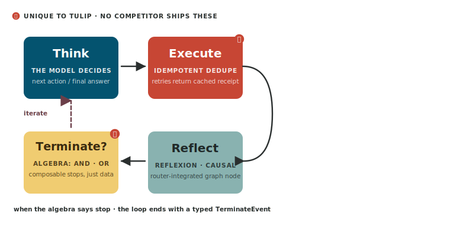

# The agent loop

Every Tulip agent runs the same
loop. Four named nodes (`Think → Execute → Reflect → Terminate`), one
router that decides what runs next, one typed event stream, one piece of
immutable state that flows through. This page is the architectural
reference — what each node does, why it exists, what it emits, and how
to extend it.



The loop is implemented in
[`src/tulip/loop/`](https://github.com/tuliplabs-ai/sdk-python/tree/main/src/tulip/loop)
and is composed of four files:
[`react.py`](https://github.com/tuliplabs-ai/sdk-python/blob/main/src/tulip/loop/react.py) (the runner),
[`nodes.py`](https://github.com/tuliplabs-ai/sdk-python/blob/main/src/tulip/loop/nodes.py) (Think / Execute / Reflect / Terminate),
[`router.py`](https://github.com/tuliplabs-ai/sdk-python/blob/main/src/tulip/loop/router.py) (transitions),
and [`runner.py`](https://github.com/tuliplabs-ai/sdk-python/blob/main/src/tulip/loop/runner.py)
(the loop driver that wires the nodes together).

## Origin: ReAct, then refinement

The base pattern is **ReAct** ([Yao et al., 2022](https://arxiv.org/abs/2210.03629)) —
*Thought → Action → Observation*, repeated until the model decides
to stop. ReAct is now the default loop in most agentic SDKs.

The SDK keeps the spirit and adds three things:

- **Action becomes Execute** — a real node in the graph that owns
  tool dispatch *and* idempotency dedup, not a callback.
- **Reflect becomes its own node** — a structured self-evaluation step
  that runs *between* Execute and the next Think. The router can route
  to Reflect on a fixed cadence, on tool errors, or when loop-detection
  trips.
- **Terminate becomes algebra** — stopping is a tree of typed conditions
  composed with `&` and `|`, evaluated after every iteration.

```text
                ┌──── another iteration ─────┐
                │                            ▼
   ┌────────┐    ┌────────┐    ┌─────────┐    ┌────────────┐
   │  Think │───▶│ Execute│───▶│ Reflect │───▶│ Terminate? │──── done
   └────────┘    └────────┘    └─────────┘    └────────────┘
```

## State

Every node receives an `AgentState` and returns a new `AgentState`.
State is **immutable** — updates produce a new instance via
`state.with_message(...)`, `state.with_tool_execution(...)`,
`state.with_metadata(...)`. Hooks see frozen events; nodes see
frozen state.

The state value object carries:

- **`messages`** — the conversation in chat format, including the
  system prompt, the user's prompt, every model message, and every
  tool result.
- **`tool_executions`** — a chronological list of every tool call,
  its arguments, its result, and a hash of `(name, kwargs)` used by
  Execute for idempotent dedup.
- **`iterations`** — the running iteration counter, consumed by
  termination conditions.
- **`metadata`** — a free-form dict for hooks and applications to
  thread their own data.

## Think

The Think node calls the configured model with the current message
list and gets back either a final answer or a set of tool calls to
fire. It emits a `ThinkEvent` with the model's reasoning content (when
the provider exposes it — extended-thinking models do; older models
don't) and a `ModelChunkEvent` per streamed token.

If the model returned text and no tool calls, the router transitions
straight to Terminate. If it returned tool calls, the router goes
to Execute.

## Execute

The Execute node fires the tool calls returned by Think. Two
behaviours make it different from a "just run the function" callback:

1. **Idempotent dedup.** For tools tagged `@tool(idempotent=True)`,
   Execute walks `state.tool_executions` and looks for a previous
   call with the same `(tool_name, arguments)` tuple. If found, the
   cached result is returned; the body never runs. The model can
   retry, loop, or panic without firing the tool a second time.
   Implementation:
   [`_find_matching_execution()` `loop/nodes.py:114`](https://github.com/tuliplabs-ai/sdk-python/blob/main/src/tulip/loop/nodes.py#L114-L144) — called from `ExecuteNode.execute` at [`loop/nodes.py:195`](https://github.com/tuliplabs-ai/sdk-python/blob/main/src/tulip/loop/nodes.py#L195).

2. **Parallel dispatch.** Tool calls returned in the same model
   response fire concurrently. Execute awaits them all before
   returning to the router. Errors in one tool don't cancel the
   others; each tool's error becomes a tool-error message in the
   state.

Execute emits `ToolStartEvent` and `ToolCompleteEvent` per call.
Cached short-circuits emit a `ToolCacheHitEvent` so the run-trace
shows them distinctly.

## Reflect

The Reflect node runs a structured self-evaluation between Execute
and the next Think. It's gated — the router decides when to Reflect
rather than going straight back to Think:

- **Fixed cadence.** `reflexion_interval=N` reflects every N
  iterations (default disabled).
- **On tool error.** Reflect always runs after a tool that raised.
- **On loop detection.** The Reflector tracks the recent
  tool-execution sequence and triggers Reflect when it spots a
  repeating pattern.

The Reflector itself
([`Reflector` class — `reasoning/reflexion.py:70`](https://github.com/tuliplabs-ai/sdk-python/blob/main/src/tulip/reasoning/reflexion.py#L70))
asks the model to evaluate its last step, adjusts a confidence
score, and emits a `ReflectEvent` carrying the judgment text and
new confidence. The next Think sees the reflection in its message
stream.

Two complementary reasoning add-ons share the Reflect node:

- **Grounding** — scores the agent's recent claims against tool
  results (rule-based by default; LLM-as-judge when configured).
- **Causal** — builds a graph of cause-effect relations from the
  tool-execution trace and surfaces cycles or contradictions.

Both are off by default and switch on via `Agent(grounding=True)` /
`Agent(causal=True)`. Source:
[`GroundingEvaluator` `reasoning/grounding.py:106`](https://github.com/tuliplabs-ai/sdk-python/blob/main/src/tulip/reasoning/grounding.py#L106) ·
[`CausalChain` `reasoning/causal.py:160`](https://github.com/tuliplabs-ai/sdk-python/blob/main/src/tulip/reasoning/causal.py#L160).

## Terminate

After every iteration the router checks the agent's `terminate`
condition. The condition is a typed object — `MaxIterations`,
`TokenLimit`, `TimeLimit`, `NoToolCalls`, `ToolCalled`,
`ConfidenceMet`, `TextMention`, or `CustomCondition` — composable
with `&` (And) and `|` (Or):

```python
from tulip.core.termination import (
    MaxIterations, ToolCalled, ConfidenceMet, TokenLimit,
)

terminate = (
    ToolCalled("submit_po") & ConfidenceMet(0.9)
) | MaxIterations(10) | TokenLimit(15_000)
```

The composite itself is a `TerminationCondition` whose `check()`
walks the tree and short-circuits on the first satisfied branch. The
router emits a `TerminateEvent` carrying the satisfied condition's
name + reason, then exits the loop.

Source:
[`src/tulip/core/termination.py`](https://github.com/tuliplabs-ai/sdk-python/blob/main/src/tulip/core/termination.py).

## The router

Transitions between nodes are decided by
[`Router` class — `loop/router.py:36`](https://github.com/tuliplabs-ai/sdk-python/blob/main/src/tulip/loop/router.py#L36) (the `route_from_reflect` rule lives at [line 126](https://github.com/tuliplabs-ai/sdk-python/blob/main/src/tulip/loop/router.py#L126)).
It is a pure function of `(current_node, state)` returning the next
node — no hidden state, no side effects, no surprises. Three rules:

| From | To | When |
|---|---|---|
| Think | Execute | the model returned tool calls |
| Think | Terminate | the model returned text only |
| Execute | Reflect | the cadence / error / loop-detection rule fires |
| Execute | Think | otherwise |
| Reflect | Think | always (Reflect feeds back into the next Think) |
| any | Terminate | `terminate.check(state)` returns true |

Termination is checked after every node, not just at the top of the
loop, so an agent can stop mid-cycle if a condition fires.

## Events

Each node emits typed, **write-protected** events that hooks can
observe but never mutate:

| Event | Emitted by |
|---|---|
| `ThinkEvent` | Think, when the model returns reasoning |
| `ModelChunkEvent` | Think, per streamed chunk |
| `ToolStartEvent` | Execute, before each tool fires |
| `ToolCompleteEvent` | Execute, after each tool returns (sets `error` on failure) |
| `ReflectEvent` | Reflect, after each self-evaluation |
| `GroundingEvent` | Reflect, after each grounding pass |
| `InterruptEvent` | Execute, when a tool requests human input |
| `TerminateEvent` | Terminate, when the loop exits |

Events are Pydantic models with `model_config = {"frozen": True}`.
They serialise cleanly to JSON for SSE, telemetry, and structured
logging.

## Hooks

Hooks are how you observe and *steer* the loop without forking it.
Each hook receives every event and can return one of three control
directives:

- `Continue()` — default, do nothing (most hooks).
- `Cancel(reason)` — abort the run cleanly with a `TerminateEvent`
  whose reason is your string.
- `Retry()` — re-run the last node (useful in `ModelRetryHook` for
  transient model errors).

Built-in hooks:
[`LoggingHook`](hooks.md), `StructuredLoggingHook`,
`TelemetryHook` (OpenTelemetry-compatible),
`ModelRetryHook`, `GuardrailsHook` (topic policy + PII redaction),
and `SteeringHook` (LLM-as-judge tool approval). Source:
[`hooks/builtin/__init__.py`](https://github.com/tuliplabs-ai/sdk-python/blob/main/src/tulip/hooks/builtin/__init__.py) (re-exports the four most-used hooks) ·
[`hooks/builtin/steering.py`](https://github.com/tuliplabs-ai/sdk-python/blob/main/src/tulip/hooks/builtin/steering.py) ·
[`hooks/builtin/retry.py`](https://github.com/tuliplabs-ai/sdk-python/blob/main/src/tulip/hooks/builtin/retry.py).

## A concrete example

Consider this prompt against the agent on the homepage:

> *"Book a flight from JFK to NRT on 2026-05-04 for customer C-42."*

Iteration by iteration:

| # | Node | What happens |
|---|---|---|
| 1 | Think | Model emits a tool call: `search_flights(origin="JFK", destination="NRT", date="2026-05-04")`. Streams `ThinkEvent` + `ModelChunkEvent`s. |
| 1 | Execute | Runs `search_flights`. Tool is **not** marked idempotent (read-only) so no dedup. Result added to `state.tool_executions`. Emits `ToolStartEvent`, `ToolCompleteEvent`. |
| 1 | Reflect | Skipped — first iteration, no error, no loop. Router goes back to Think. |
| 1 | Terminate? | `MaxIterations(8)` not yet hit. `ToolCalled("book_flight")` not satisfied. Continue. |
| 2 | Think | Model picks `AA-181` from the search results and emits `book_flight(flight_id="AA-181", customer_id="C-42")`. |
| 2 | Execute | Tool is `idempotent=True`. Execute hashes `("book_flight", {flight_id: "AA-181", customer_id: "C-42"})` and walks `state.tool_executions` for matches. None — so the body fires. Confirmation `BK-58291` returned. |
| 2 | Reflect | Reflexion runs (the cadence trigger fires). Confidence assessed at 0.93. `ReflectEvent` emitted. |
| 2 | Terminate? | `ToolCalled("book_flight")` ✓ AND `ConfidenceMet(0.9)` ✓. The AND branch fires; the OR short-circuits true. Loop exits with `TerminateEvent(reason="ToolCalled AND ConfidenceMet")`. |

Total: **two iterations, two tool calls, one Reflect, one Terminate**.

If the model had hallucinated and re-emitted `book_flight` with the
same args on iteration 3 (it didn't, but it could), Execute would
have caught the duplicate `(name, kwargs)` hash, returned the cached
`BK-58291`, and emitted a `ToolCacheHitEvent` so the trace shows the
short-circuit clearly.

## Stop reasons

Every run ends with a `TerminateEvent` whose `reason` field names the
satisfied condition. The named reasons you'll see:

| Reason | When |
|---|---|
| **`MaxIterations`** | the iteration counter hit the configured ceiling |
| **`TokenLimit`** | cumulative model tokens exceeded the budget |
| **`TimeLimit`** | wall-clock budget exceeded |
| **`NoToolCalls`** | the model emitted text and no tool calls (the natural "I'm done" signal) |
| **`ToolCalled`** | a specific tool fired (with optional args predicate) |
| **`ConfidenceMet`** | the Reflexion confidence score cleared the threshold |
| **`TextMention`** | the final message matched a regex |
| **`CustomCondition`** | a user-supplied `(state) -> bool` returned true |
| **`Cancelled`** | a hook returned `Cancel(reason="…")` or the caller called `agent.cancel()` |
| **`ModelError`** | the model raised after retries exhausted |

Composite conditions (`OrCondition`, `AndCondition`) report the
underlying satisfied leaf, so you always get a leaf-condition name in
the reason.

## Cancellation

Three ways to stop a running agent without waiting for the natural
terminate condition:

### From a hook

Any hook can return `Cancel(reason="…")` from any event. The current
node finishes (so a tool call is not torn out mid-flight), then the
loop exits with `TerminateEvent(reason="Cancelled: …")`. Useful for
the `SteeringHook`, which votes on each tool call before it fires
and can cancel the whole run if the model proposes something out of
policy.

```python
class CostGuardHook(Hook):
    async def on_iteration(self, ev: IterationEvent) -> Directive:
        if ev.token_total > 100_000:
            return Cancel(reason=f"token budget exhausted at {ev.token_total}")
        return Continue()
```

### From the caller

```python
import asyncio

run = asyncio.create_task(agent.run(prompt))
# … later, on a timeout, on a user click, on whatever:
run.cancel()
```

The runner observes the cancellation between nodes and exits cleanly.
In-flight tool calls running on asyncio see the standard
`CancelledError` propagate through their await points; cooperative
tools can catch it to release resources before re-raising.

### Via `agent.cancel()`

`agent.cancel()` sets a flag the runner polls between nodes. The
loop exits at the next safe point with a
`TerminateEvent(reason="Cancelled")`. For thread-bound runs, the
state still flushes to the checkpointer before exit, so the
conversation can resume cleanly later.

## Common problems

### Context window exhaustion

Long-running agents accumulate every model message and every tool
result in `state.messages`. Eventually the next Think exceeds the
provider's context window and fails. Three remedies:

1. **Wire a conversation manager** —
   `Agent(conversation_manager=LLMCompactor(...))` protects the
   system prompt and the most recent turns, then summarises the
   middle on demand. Source:
   [`src/tulip/memory/compactor.py`](https://github.com/tuliplabs-ai/sdk-python/blob/main/src/tulip/memory/compactor.py).
2. **Tighten tool result size** — return concise structured data,
   not blobs of HTML. The model rarely needs the full source.
3. **Decompose with multi-agent** — let an orchestrator delegate
   long sub-tasks to specialists with their own short context.

### Tool selection mistakes

If the model picks the wrong tool, it's almost always the tool's
description that's the bug. Tool docstrings are part of the
contract the model sees. Be explicit: *when to use this tool, when
not to, what the inputs mean.*

### Loops that never converge

Symptom: the agent calls the same tool with slightly-different args,
five times, then hits `MaxIterations` and gives up. Two fixes:

- **Reflect on cadence** — `reflexion=True` (with the default
  cadence) catches loops via the Reflector's pattern detector.
- **Terminate on no-progress** — compose a `CustomCondition` that
  fires when the latest tool result equals the previous one.

### Idempotency key collisions

If two semantically-different calls happen to produce the same
`(name, kwargs)` hash, Execute will dedup the second one and the
agent will get a stale receipt. Fix by including a per-request
identifier in the args (e.g., `request_id`) so the hash discriminates
distinct calls.

## Putting it together

```python
from tulip.agent import Agent
from tulip.tools.decorator import tool
from tulip.memory.backends import S3Backend
from tulip.core.termination import (
    MaxIterations, ToolCalled, ConfidenceMet,
)
from tulip.hooks.builtin import StructuredLoggingHook

@tool(idempotent=True)
def submit_po(vendor_id: str, amount_usd: float) -> dict:
    return finance.submit(vendor_id, amount_usd)

agent = Agent(
    model="anthropic:claude-sonnet-4-6",
    tools=[search_vendors, submit_po],
    system_prompt="You are a procurement officer.",
    reflexion=True,                    # turn Reflect on
    grounding=True,                    # claim verification
    checkpointer=S3Backend(...),
    hooks=[StructuredLoggingHook(level="INFO")],
    termination=(
        ToolCalled("submit_po") & ConfidenceMet(0.9)
    ) | MaxIterations(10),
)

async for event in agent.run("Find a vendor for $2M cloud spend.",
                             thread_id="th-q3-2026"):
    match event:
        case ThinkEvent(reasoning=r) if r:    print(f"💭 {r}")
        case ToolStartEvent(tool_name=n):     print(f"🔧 {n}")
        case ReflectEvent(judgment=j):        print(f"🪞 {j}")
        case TerminateEvent(reason=why):      print(f"✅ {why}")
```

## What you can configure

| `Agent(...)` argument | Loop effect |
|---|---|
| `model=` | which provider Think calls |
| `tools=` | what Execute can dispatch |
| `system_prompt=` | prepended to the message list before the first Think |
| `reflexion=True` | enables Reflect on the configured cadence / triggers |
| `grounding=True` | adds claim verification inside Reflect |
| `checkpointer=` | persists state at every node so the run can resume after restart |
| `conversation_manager=` | summarises / prunes long histories before they exceed the context window |
| `hooks=` | observe and steer every event |
| `termination=` | the algebra the router checks after each node |
| `max_iterations=` | shorthand cap; equivalent to `termination=MaxIterations(N)` |
| `tool_execution=` | `"concurrent"` (default) or `"sequential"` |

## Where to next

- [Tools](tools.md) — how to write the things Execute calls.
- [Idempotency](idempotency.md) — why and when to mark a tool idempotent.
- [Reasoning](reasoning.md) — Reflexion / Grounding / Causal in detail.
- [Termination](termination.md) — every built-in condition + composition.
- [Events & Streaming](events.md) — the typed event taxonomy.
- [Hooks](hooks.md) — observe + steer.
- [Multi-agent](multi-agent.md) — the loop runs inside seven coordination patterns plus A2A.
