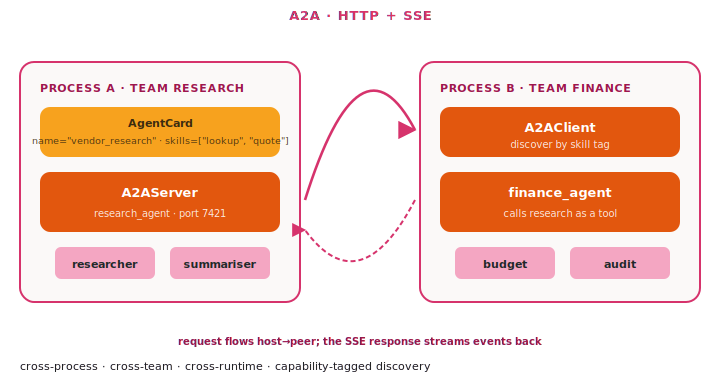

# A2A — Agent-to-Agent

A2A is the **cross-process / cross-runtime** version of multi-agent.
Each agent runs as its own service, advertises an Agent Card
(capabilities + skills + endpoint URL) at a well-known URL, and other
agents discover and call it over HTTP.

Tulip implements the public
[A2A protocol](https://a2aproject.github.io/A2A/) — the same wire
format used by Strands, ADK, and Google's reference SDKs — so an
SDK-built agent can call a non-SDK A2A peer (or be called by one)
without an adapter.

{ .diagram }

## Wire surface

`A2AServer` is v1.0-first while preserving the older Tulip/pre-v1
surface. Clients that request v1.0 send `A2A-Version: 1.0`; clients
that request another version, or use the old method names, continue to
hit the legacy dispatcher.

`A2AServer` exposes:

| Endpoint | Purpose |
|---|---|
| `GET /.well-known/agent-card.json` | Public Agent Card — name, description, skills, capabilities, modes, `protocolVersion`, and `supportedInterfaces`. |
| `POST /` + `A2A-Version: 1.0` | A2A v1.0 JSON-RPC dispatch — `SendMessage`, `SendStreamingMessage`, `GetTask`, `CancelTask`. |
| `POST /` with old methods | Legacy JSON-RPC dispatch — `message/send`, `message/stream`, `tasks/get`, `tasks/cancel`. |
| `GET /agent-card`, `POST /a2a/{invoke,stream}` | Backwards-compat aliases for peers using the original Tulip shape. |

The v1.0 Task lifecycle uses protocol enum values such as
`TASK_STATE_SUBMITTED`, `TASK_STATE_WORKING`, and
`TASK_STATE_COMPLETED`. Tulip still maps those to the Python-facing
`TaskState` enum (`submitted`, `working`, `completed`, ...) for SDK
callers. Streaming responses on `SendStreamingMessage` arrive as SSE
JSON-RPC envelopes whose `result` is a v1.0 `StreamResponse`, containing
exactly one of `task`, `message`, `statusUpdate`, or `artifactUpdate`.
The old `final` streaming flag is not emitted on the v1.0 path.

The Python SDK keeps the familiar `TextPart`, `FilePart`, and `DataPart`
models. On the v1.0 wire they are converted to the v1.0 oneof part
shape (`text`, `raw`, `url`, `data`) and back.

## When to use it

- ✅ **Multi-process or multi-host** agent deployments.
- ✅ **Different teams own different agents** on different stacks.
- ✅ You need a **network boundary** for security or scaling.
- ✅ **Polyglot** — an SDK agent calling a non-SDK A2A peer (or
  vice versa) speaks the same protocol verbatim.
- ✅ **Capability-based discovery** — the caller reads the Agent
  Card and decides whether to delegate.

## When NOT to use it

- ❌ **Single-process** — use one of the in-process patterns; HTTP
  round-trips are pure overhead.
- ❌ **Tight latency requirements** — A2A adds 10–50ms per hop.
- ❌ The peer is **always the same agent** — just call it directly.

## Code

### Host side — expose an agent over A2A

```python
from tulip.agent import Agent
from tulip.a2a import A2AServer, AgentSkill

research_agent = Agent(
    model="anthropic:claude-sonnet-4-6",
    tools=[search_corpus, summarise, cite],
    system_prompt="You read the vendor catalogue and quote prices.",
)

server = A2AServer(
    agent=research_agent,
    name="vendor_research",
    description="Reads the vendor catalogue. Quotes prices.",
    url="https://research.example.com",
    skills=[
        AgentSkill(
            id="vendor_lookup",
            name="Vendor lookup",
            description="Find vendors by name or capability tag.",
            tags=["catalogue", "vendor"],
        ),
        AgentSkill(
            id="price_quote",
            name="Price quote",
            description="Quote three options for a target spend.",
            tags=["pricing"],
        ),
    ],
    api_key="rotate-this-secret",
)
server.run(host="0.0.0.0", port=7421)
```

The Agent Card is now reachable at
`https://research.example.com/.well-known/agent-card.json` (with the
required bearer token).

### Client side — fetch the card and send a message

```python
from tulip.a2a import A2AClient, Message, TextPart

client = A2AClient(url="https://research.example.com", api_key="rotate-this-secret")

# Read the public card to learn the agent's skills + capabilities.
card = await client.get_agent_card()
print(card.name, [s.id for s in card.skills])

# Synchronous send — returns a Task in the `completed` state.
task = await client.send_message(
    Message(
        role="user",
        parts=[TextPart(text="Quote three options for $2M cloud spend.")],
        messageId="m-1",
    )
)
final_text = task.artifacts[-1].parts[0].text
print(final_text)
```

By default `A2AClient` sends `A2A-Version: 1.0` and uses the v1.0 method
names. If it talks to an older peer that returns a legacy Task directly,
the client still accepts it and maps it back into the SDK `Task` model.
To force the older JSON-RPC method names from the client, pass
`protocol_version=None` or another non-`"1.0"` value and call the legacy
helpers.

### Streaming

```python
async for event in client.send_message_streaming(
    Message(
        role="user",
        parts=[TextPart(text="Quote three options for $2M cloud spend.")],
        messageId="m-2",
    )
):
    if event.get("kind") == "status-update":
        print("status:", event["status"]["state"])
    elif event.get("kind") == "artifact-update":
        print("got artifact")
    elif event.get("kind") == "task":
        print("initial task:", event["id"])
```

`send_message_streaming()` returns SDK-shaped events to Python callers
even though the wire format is v1.0 when `A2A-Version: 1.0` is active.
This keeps existing router and application code stable while the HTTP
boundary remains protocol-correct.

### Task lifecycle

```python
task = await client.send_message(message)
# Long-running tasks: poll while still in working / input-required.
fresh = await client.get_task(task.id)
if fresh.status.state == "input-required":
    # ... gather input from the human, then send a follow-up message
    ...
# Or list tasks by context / status.
tasks, next_page = await client.list_tasks(
    context_id=task.contextId,
    status="completed",
    page_size=20,
)
# Or cancel.
await client.cancel_task(task.id)
```

`list_tasks()` calls the v1.0 `ListTasks` method and maps the response
back into SDK `Task` objects, returning `(tasks, next_page_token)`.

## Router delegation

The cognitive router's `a2a_delegate` protocol now delegates through
`A2AClient.send_message()` first, so router-to-remote-agent calls use
the v1.0 path by default. If the remote peer answers that `SendMessage`
is not found, the runnable falls back to the legacy flat
`/a2a/invoke` convenience call.

```python
from tulip.router import BuilderContext, CognitiveCompiler

ctx = BuilderContext(
    model=model,
    capabilities=capability_index,
    a2a_endpoint="https://research.example.com",
)
compiler = CognitiveCompiler(ctx)
```

The remote agent still owns its tools and orchestration. The router
passes a single user message, then unwraps the final text from the
returned Task artifact for the normalized `RunnableResult`.

## Auth + TLS

`A2AServer` ships with bearer-token auth: pass `api_key="..."` (or set
`TULIP_A2A_API_KEY`) and every route — including
`/.well-known/agent-card.json` — requires `Authorization: Bearer ...`.
With no key the server refuses non-loopback bindings unless
`allow_unauthenticated=True` is passed (use that only behind an
upstream proxy that terminates auth). TLS is the standard FastAPI
story — terminate it at your load balancer or via uvicorn's `--ssl-*`
flags.

## Backwards compatibility

The pre-spec endpoints are still served:

```python
# Legacy: flat string-in / string-out — bypass the JSON-RPC envelope.
reply = await client.invoke("Quote three options...")
```

Anything that imported `A2AMessage` / `A2ARequest` / `A2AResponse` from
`tulip.a2a.protocol` keeps working — those models are preserved as
aliases for the legacy `/a2a/invoke` shape. Spec-aware peers should
use `Message` + `client.send_message()` so they can read the full
`Task` (status, history, artifacts).

## Notebook

[`notebook_28_a2a_protocol.py`](https://github.com/tuliplabs-ai/sdk-python/blob/main/examples/notebook_28_a2a_protocol.py)
— host + client + streaming.

## Source

[`a2a/spec.py`](https://github.com/tuliplabs-ai/sdk-python/blob/main/src/tulip/a2a/spec.py)
— typed Pydantic models for every spec object.

[`a2a/protocol.py`](https://github.com/tuliplabs-ai/sdk-python/blob/main/src/tulip/a2a/protocol.py)
— `A2AServer`, `A2AClient`, JSON-RPC dispatch, in-memory task store.

## See also

- [Multi-agent overview](../multi-agent.md) — pick a shape.
- [Agent Server](../server.md) — the in-process FastAPI wrapper that
  A2A is built on top of.
- [Conversation Management](../conversation-management.md) —
  `contextId` flows across A2A so peers share context.
