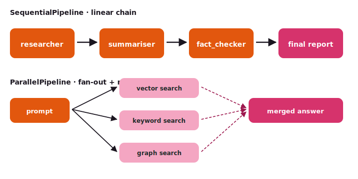

# Composition — pipelines

The composition primitives are for flows you can write as a regular
function: do A, then B, then C — with optional fan-out and merge.

{ .diagram }

## What it is

Three `BaseModel`-shaped pipeline classes, all wrapping a list of
agents (or other pipelines):

| Class | Shape |
|---|---|
| `SequentialPipeline(agents=[...])` | output of agent N feeds agent N+1 |
| `ParallelPipeline(agents=[...])` | one input fans out to all N agents; results merge |
| `LoopAgent(agent=..., max_iterations=N)` | run one agent repeatedly until a condition holds or N is hit |

Each composes an `Agent` and walks like one — `.run`, `.run_sync`,
the same event stream.

## When to use it

- ✅ The flow is **describable as a function** — "do A, then B, then C".
- ✅ Fan-out is **symmetric** — all branches do similar work on the same
  input (e.g., multi-source RAG).
- ✅ You need **revise-until-confidence** — wrap the writer in a `LoopAgent`
  with a stop condition.
- ✅ You don't need cycles, conditional branches, or per-node retry policies.

## When NOT to use it

- ❌ You need **cycles** that depend on state — use [StateGraph](graph.md).
- ❌ A central agent should **decide which expert runs** — use [Orchestrator](orchestrator.md).
- ❌ The branches need to **talk to each other** — use [Swarm](swarm.md).

## Code

```python
from tulip.agent.composition import (
    SequentialPipeline, ParallelPipeline, LoopAgent,
)

# Sequential: research → summarise → fact-check → format
pipeline = SequentialPipeline(agents=[
    researcher,
    summariser,
    fact_checker,
    formatter,
])

result = pipeline.run_sync("Brief on Q3 launch.")
```

```python
# Parallel: hit three retrievers, merge results
parallel = ParallelPipeline(agents=[
    vector_search,
    keyword_search,
    knowledge_graph_search,
])
hits = parallel.run_sync("How do I rotate API keys?")

# Loop: revise the brief until confidence ≥ 0.85, max 5 iterations
revise = LoopAgent(agent=reviser_agent, max_iterations=5)
final = revise.run_sync(initial_draft)
```

```python
# Compose nested — Sequential of (Parallel + LoopAgent)
end_to_end = SequentialPipeline(agents=[
    ParallelPipeline(agents=[researcher, fact_checker]),
    summariser,
    LoopAgent(agent=reviser, max_iterations=5),
])
result = end_to_end.run_sync("Brief on Q3 launch.")
```

## Notebooks

- [`notebook_21_composition.py`](https://github.com/tuliplabs-ai/sdk-python/blob/main/examples/notebook_21_composition.py)
  — `SequentialPipeline`, `ParallelPipeline`, `LoopAgent`.
- [`notebook_30_map_reduce_code_review.py`](https://github.com/tuliplabs-ai/sdk-python/blob/main/examples/notebook_30_map_reduce_code_review.py)
  — same fan-out shape with `Send` inside a graph (use this when you
  need state-aware fan-out beyond what `ParallelPipeline` gives you).
- [`notebook_31_supervisor_critic_loop.py`](https://github.com/tuliplabs-ai/sdk-python/blob/main/examples/notebook_31_supervisor_critic_loop.py)
  — `LoopAgent`-style refine-until-confidence written as a graph
  (the cycle version when you also need conditional edges).

## Source

[`agent/composition.py`](https://github.com/tuliplabs-ai/sdk-python/blob/main/src/tulip/agent/composition.py)
— `SequentialPipeline`, `ParallelPipeline`, `LoopAgent`.

## See also

- [Multi-agent overview](../multi-agent.md) — all seven coordination patterns plus A2A.
- [StateGraph](graph.md) — when you need cycles or conditional branches.
- [Functional](functional.md) — when you'd rather use plain asyncio.gather.
