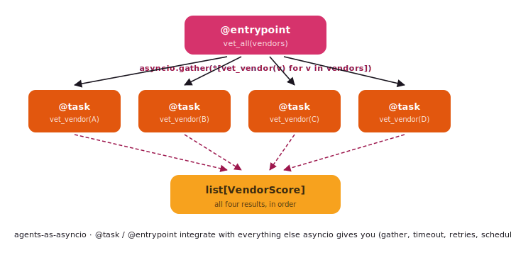

# Functional API

The functional API is the Tulip's "agent as a task" shape — `@task` and `@entrypoint` decorators
that bring agent runs into the regular asyncio universe.

{ .diagram }

## What it is

Two decorators:

| Decorator | What it does |
|---|---|
| **`@task`** | Wraps a coroutine that calls an `Agent`. Returns a `Task` you can `await`, `gather`, retry, time-out — anything asyncio gives you. |
| **`@entrypoint`** | Marks the top-level coroutine of a workflow. Adds `.run` / `.run_sync` so you can invoke the workflow synchronously from non-async code. |

These are **not a new orchestration runtime**. They're a thin shim
that lets agents participate in plain asyncio. The point is to
compose with `asyncio.gather`, `asyncio.wait_for`, `asyncio.Queue`,
or anything else you already use.

## When to use it

- ✅ You think in **`async def` and `asyncio.gather`** already.
- ✅ The flow is **map/reduce** over agents (vet N vendors in
  parallel).
- ✅ You want to **mix agents with non-agent code** — DB writes,
  HTTP calls, file I/O — in the same coroutine.
- ✅ Tooling like **`tenacity` retries**, **`asyncio.timeout`**, or a
  **`asyncio.Queue` scheduler** already gives you the orchestration
  you need.

## When NOT to use it

- ❌ You want **inspectable, named control-flow** with cycles or
  conditional branches → use [StateGraph](graph.md).
- ❌ You need **per-node retry / cache policies as data** →
  [StateGraph](graph.md).
- ❌ Different agents should **decide who runs** → use
  [Orchestrator](orchestrator.md).

## Code

```python
import asyncio
from tulip.multiagent.functional import task, entrypoint

@task
async def vet_vendor(vendor: dict) -> dict:
    """Run the compliance agent against one vendor."""
    return await compliance_agent.run(f"Vet {vendor['name']}.")

@entrypoint
async def vet_all(vendors: list[dict]) -> list[dict]:
    """Vet every vendor in parallel; gather the results."""
    return await asyncio.gather(*[vet_vendor(v) for v in vendors])

scored = vet_all.run_sync(catalogue)
```

## Map/reduce with retries and timeouts

Because tasks are plain coroutines, you compose with whatever the
asyncio ecosystem provides:

```python
from tenacity import retry, stop_after_attempt, wait_exponential

@task
@retry(stop=stop_after_attempt(3), wait=wait_exponential(multiplier=0.5))
async def vet_vendor(vendor: dict) -> dict:
    return await compliance_agent.run(f"Vet {vendor['name']}.")

@entrypoint
async def vet_all_with_deadline(vendors: list[dict]) -> list[dict]:
    async with asyncio.timeout(60):                # 60s wall-clock cap
        return await asyncio.gather(*[vet_vendor(v) for v in vendors])
```

## Tasks calling tasks

Tasks compose. An `@entrypoint` workflow can call other `@task`s
including parallel batches inside sequential phases:

```python
@task
async def shortlist_vendors(catalogue: list[dict]) -> list[dict]:
    return await procurement_agent.run(f"Shortlist 5 from {len(catalogue)}.")

@task
async def vet(vendor: dict) -> dict:
    return await compliance_agent.run(f"Vet {vendor['name']}.")

@entrypoint
async def end_to_end(catalogue: list[dict]) -> dict:
    shortlisted = await shortlist_vendors(catalogue)        # phase 1
    scored = await asyncio.gather(*[vet(v) for v in shortlisted])  # phase 2 (parallel)
    final = await approval_agent.run(f"Approve from: {scored}")    # phase 3
    return final
```

## Notebooks

- [`notebook_23_functional_api.py`](https://github.com/tuliplabs-ai/sdk-python/blob/main/examples/notebook_23_functional_api.py)
  — `@task` and `@entrypoint` end-to-end.
- [`notebook_30_map_reduce_code_review.py`](https://github.com/tuliplabs-ai/sdk-python/blob/main/examples/notebook_30_map_reduce_code_review.py)
  — same map/reduce shape, written as a graph with `Send` instead.
  Useful as the "graph version" comparison when you're choosing
  between functional and StateGraph for a fan-out workload.

## Source

[`multiagent/functional.py`](https://github.com/tuliplabs-ai/sdk-python/blob/main/src/tulip/multiagent/functional.py)
— `task`, `entrypoint`, `TaskResult`, `EntrypointResult`.

## See also

- [Multi-agent overview](../multi-agent.md) — pick a shape.
- [StateGraph](graph.md) — for the same fan-out *as data* with
  inspectable retry/cache policies.
- [Composition](composition.md) — for the same shapes via
  `ParallelPipeline`.
