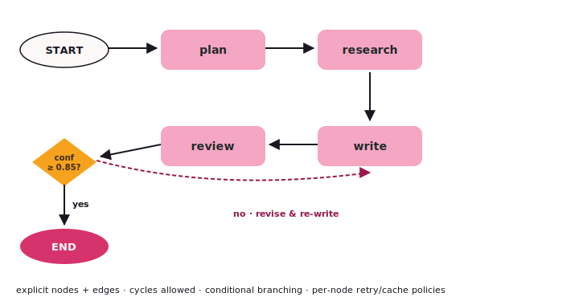

# StateGraph

`StateGraph` is the **explicit-control-flow** shape: nodes do work,
edges decide what runs next, and state flows through. Cycles
(retry-until-confidence), conditional branches, and subgraphs are
all first-class.

{ .diagram }

## What it is

- **`StateGraph(state_schema=...)`** — a builder bound to a typed
  state shape (your own dataclass or BaseModel).
- **`add_node(name, agent_or_callable)`** — a unit of work.
- **`add_edge(src, dst)`** — unconditional transition.
- **`add_conditional_edges(src, fn)`** — `fn(state) → next_node_name`
  picks the next node dynamically.
- **`compile()`** — produces a runnable graph; `run` and `run_sync`
  walk like any agent.

State is a typed value object with custom **reducers** that control
how each node's output merges into shared fields.

## When to use it

- ✅ The flow has **cycles** — review-loop, retry, refine-until-confidence.
- ✅ You want **explicit, inspectable control flow** with a Mermaid
  diagram you can paste into a design doc.
- ✅ You need **per-node retry / cache policies** (different policies
  per node).
- ✅ **Subgraphs** — encapsulate a sub-workflow as a single node.

## When NOT to use it

- ❌ The flow is a **straight pipe** with maybe a fan-out → use
  [Composition](composition.md).
- ❌ You don't know the flow at design time; agents should
  **self-organise** → use [Swarm](swarm.md).
- ❌ A central agent should **decide which expert runs next** → use
  [Orchestrator](orchestrator.md).

## Code

```python
from tulip.multiagent import StateGraph, END
from pydantic import BaseModel, Field

class ResearchState(BaseModel):
    prompt: str
    research_notes: list[str] = Field(default_factory=list)
    draft: str = ""
    confidence: float = 0.0

graph = StateGraph(state_schema=ResearchState)

graph.add_node("plan", plan_agent)
graph.add_node("research", research_agent)
graph.add_node("write", write_agent)
graph.add_node("review", review_agent)

graph.add_edge("plan", "research")
graph.add_edge("research", "write")
graph.add_edge("write", "review")

graph.add_conditional_edges(
    "review",
    lambda state: END if state.confidence >= 0.85 else "research",
)

result = graph.compile().run_sync({"prompt": "Write a launch brief."})
print(result.draft)
```

## Per-node policies

```python
from tulip.multiagent.graph import RetryPolicy, CachePolicy

graph.add_node(
    "research",
    research_agent,
    retry_policy=RetryPolicy(max_attempts=3, backoff="exponential"),
    cache_policy=CachePolicy(ttl_seconds=3600),
)
```

Retries handle transient failures inside the node. Cache
short-circuits when an identical input has been seen recently
(useful for expensive pure-function nodes).

## Send / SendBatch — fan-out inside a graph

For map/reduce inside a graph use the `Send` primitive from
`tulip.core.send`:

```python
from tulip.core.send import Send

def fan_out_review(state):
    return [Send("review_one", {"vendor": v}) for v in state.vendors]

graph.add_conditional_edges("plan", fan_out_review)
graph.add_node("review_one", review_one_vendor_agent)
graph.add_edge("review_one", "merge")
graph.add_node("merge", merge_reviews_agent)
```

Each `Send` becomes a parallel invocation of the target node with
the given partial state. The merge node sees all results.

## Mermaid visualisation

```python
graph.compile().get_mermaid()
```

…returns a Mermaid flowchart string you can paste into the docs or
a design review.

## Notebooks

- [`notebook_16_basic_graph.py`](https://github.com/tuliplabs-ai/sdk-python/blob/main/examples/notebook_16_basic_graph.py)
  — your first StateGraph.
- [`notebook_17_conditional_routing.py`](https://github.com/tuliplabs-ai/sdk-python/blob/main/examples/notebook_17_conditional_routing.py)
  — `add_conditional_edges`.
- [`notebook_18_state_reducers.py`](https://github.com/tuliplabs-ai/sdk-python/blob/main/examples/notebook_18_state_reducers.py)
  — custom state reducers.
- [`notebook_22_graph_advanced.py`](https://github.com/tuliplabs-ai/sdk-python/blob/main/examples/notebook_22_graph_advanced.py)
  — `RetryPolicy`, `CachePolicy`, subgraphs, Mermaid output.
- [`notebook_30_map_reduce_code_review.py`](https://github.com/tuliplabs-ai/sdk-python/blob/main/examples/notebook_30_map_reduce_code_review.py)
  — `Send` fan-out / reduce in a graph.
- [`notebook_31_supervisor_critic_loop.py`](https://github.com/tuliplabs-ai/sdk-python/blob/main/examples/notebook_31_supervisor_critic_loop.py)
  — `allow_cycles=True` + `max_iterations` for refine-until-confidence.
- [`notebook_63_incident_response.py`](https://github.com/tuliplabs-ai/sdk-python/blob/main/examples/notebook_63_incident_response.py)
  — triage → parallel investigators → severity gate → page-the-human.
- [`notebook_64_procurement_approval.py`](https://github.com/tuliplabs-ai/sdk-python/blob/main/examples/notebook_64_procurement_approval.py)
  — stacked `interrupt()` gates with tier routing.
- [`notebook_65_contract_review.py`](https://github.com/tuliplabs-ai/sdk-python/blob/main/examples/notebook_65_contract_review.py)
  — parallel reviewers + `Command(goto=...)` to short-circuit a loop.

## Source

[`multiagent/graph.py`](https://github.com/tuliplabs-ai/sdk-python/blob/main/src/tulip/multiagent/graph.py)
— `StateGraph`, `Node`, `Edge`, `ConditionalEdge`, `RetryPolicy`,
`CachePolicy`. `Send` lives in
[`core/send.py`](https://github.com/tuliplabs-ai/sdk-python/blob/main/src/tulip/core/send.py).

## See also

- [Multi-agent overview](../multi-agent.md) — pick a shape.
- [Functional](functional.md) — when you'd rather use plain asyncio.
- [Termination](../termination.md) — composable stop conditions.
