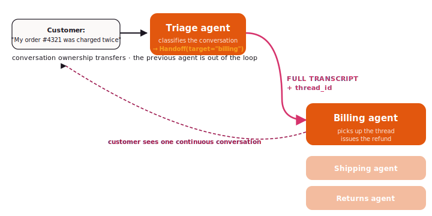

# Handoff

Handoff is what an escalation desk does. One agent owns the
conversation, decides it needs a different role, and hands the
**whole transcript** to the next agent — who picks up where it left
off.

{ .diagram }

## What it is

A `Handoff` flow has:

- An **`initial`** agent — the entry point (usually triage).
- A **`targets`** dict — name → agent for each possible next role.

The initial agent ends a turn with a `Handoff(target="billing")`
directive. The full message history transfers; the billing agent
reads it as if it were the next turn of the same conversation.
State, checkpointer, and `thread_id` survive.

## When to use it

- ✅ **Customer-support flows** where the conversation is the unit
  of work.
- ✅ **"Pass to a human"** — the human simply replaces one of the
  targets.
- ✅ **Escalation** when the first agent realises it's the wrong
  specialist (after a few turns of conversation, not on first read).
- ✅ The customer should **not have to re-explain** when control
  transfers.

## When NOT to use it

- ❌ The coordinator delegates a **sub-task** and waits for the
  answer (the conversation belongs to the coordinator) — use
  [Orchestrator](orchestrator.md) instead.
- ❌ Multiple agents should **process the conversation in parallel**
  — use [Composition](composition.md) or [Swarm](swarm.md).
- ❌ The flow is **fully scripted** — handoff is for cases where
  the routing emerges from the conversation.

## Difference vs Orchestrator

| | Handoff | Orchestrator |
|---|---|---|
| Conversation owner | **moves** between agents | stays with the coordinator |
| Routing decision | the agent that's currently in charge | always the coordinator |
| Specialist's view of history | full transcript | just the sub-task they were dispatched for |
| Customer-facing? | usually yes | usually no |

## Code

```python
from tulip.multiagent import Handoff

triage = Agent(
    model="anthropic:claude-sonnet-4-6",
    tools=[lookup_order, lookup_account],
    system_prompt=(
        "You triage incoming customer messages. "
        "Identify whether this is a billing, shipping, or returns issue. "
        "Then call Handoff(target=...)."
    ),
)
billing = Agent(
    model="anthropic:claude-sonnet-4-6",
    tools=[issue_refund, retry_charge],
    system_prompt="You handle billing escalations.",
)
shipping = Agent(
    model="anthropic:claude-sonnet-4-6",
    tools=[track_shipment, request_redelivery],
    system_prompt="You handle shipping issues.",
)
returns = Agent(
    model="anthropic:claude-sonnet-4-6",
    tools=[create_return_label],
    system_prompt="You handle returns.",
)

flow = Handoff(
    initial=triage,
    targets={"billing": billing, "shipping": shipping, "returns": returns},
)

result = flow.run_sync(
    "My order #4321 was charged twice.",
    thread_id="cust-c42-2026-04",
)
```

## What persists across the handoff

- `state.messages` — the full conversation history.
- `state.tool_executions` — including idempotency hashes, so the
  next agent won't re-fire a write the previous agent already ran.
- `state.metadata` — your application's per-conversation data.
- `thread_id` — same thread, just a different agent driving.

The receiving agent picks up the same loop. It does not see the
handoff as a "new turn"; it sees the previous transcript and the
customer's last message.

## Notebooks

- [`notebook_25_agent_handoff.py`](https://github.com/tuliplabs-ai/sdk-python/blob/main/examples/notebook_25_agent_handoff.py)
  — full triage + billing + shipping + returns escalation flow.
- [`notebook_33_multiagent_human_in_loop.py`](https://github.com/tuliplabs-ai/sdk-python/blob/main/examples/notebook_33_multiagent_human_in_loop.py)
  — handoff to a human via `interrupt()` (one of three HITL patterns
  in the same file).

## Source

[`multiagent/handoff.py`](https://github.com/tuliplabs-ai/sdk-python/blob/main/src/tulip/multiagent/handoff.py).

## See also

- [Conversation Management](../conversation-management.md) — how the
  thread is checkpointed across the handoff.
- [Multi-agent overview](../multi-agent.md) — pick a shape.
