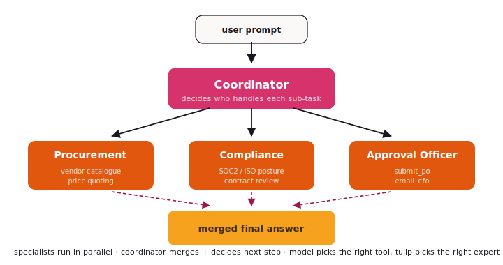

# Orchestrator + Specialists

One coordinator picks which specialist handles each sub-task. The
specialists never talk to each other — only to the orchestrator.
Think *project manager + team*.

{ .diagram }

## What it is

The coordinator is a regular `Agent` whose tool-set is **the
specialists**. Calling a specialist runs that specialist's full
agent loop and returns the answer. When the coordinator dispatches
to multiple specialists in one turn they run in parallel.

Each `Specialist` has:

- a `name` — what the coordinator calls it by
- an `agent` — the specialist's own `Agent` (its own model, tools, system prompt)
- a `description` — what the specialist is good at (the coordinator reads this)
- an optional `confidence_floor` — below this the specialist declines

## When to use it

- ✅ The work splits cleanly into **expert domains** (Procurement,
  Compliance, Approval Officer; or Research, Writing, Editing).
- ✅ You want **one place to attribute decisions to** — the coordinator.
- ✅ Specialists need their **own playbooks, skills, or models** (a
  cheap model for triage, a strong one for compliance).
- ✅ **Auditability** matters — the dispatch log is your trail.

## When NOT to use it

- ❌ The flow is **linear, not delegated** — use [Composition](composition.md).
- ❌ No central coordinator should exist; agents should
  **self-organise** — use [Swarm](swarm.md).
- ❌ The conversation itself moves between roles — use [Handoff](handoff.md).

## Code

```python
from tulip.multiagent import Orchestrator, Specialist

procurement = Specialist(
    name="procurement",
    agent=Agent(
        model="anthropic:claude-sonnet-4-6",
        tools=[search_vendors, quote_prices],
        system_prompt="You are the Procurement specialist.",
    ),
    description="Reads the catalogue. Quotes prices. Picks vendors.",
)

compliance = Specialist(
    name="compliance",
    agent=Agent(
        model="anthropic:claude-sonnet-4-6",
        tools=[check_soc2, check_iso, search_legal_terms],
        system_prompt="You are the Compliance specialist.",
    ),
    description="Vets vendors against SOC2/ISO posture. Flags red lines.",
)

approver = Specialist(
    name="approver",
    agent=Agent(
        model="anthropic:claude-sonnet-4-6",
        tools=[submit_po, email_cfo],          # ← idempotent writes
        system_prompt="You are the Approval Officer.",
    ),
    description="Submits the PO and notifies the CFO. Only after approval.",
)

orchestrator = Orchestrator(
    coordinator_model="anthropic:claude-sonnet-4-6",
    specialists=[procurement, compliance, approver],
    system_prompt=(
        "You are the procurement lead. Delegate research to procurement, "
        "vetting to compliance, and only after both agree call approver."
    ),
)

result = orchestrator.run_sync(
    "Pick three vendors for $2M of cloud spend.",
    thread_id="po-q3-2026",
)
```

## What runs in parallel

Specialists fire **concurrently** when the coordinator dispatches to
several of them in one turn. So when the coordinator says "in
parallel: procurement, get me three quotes; compliance, vet our
existing vendor list" — both specialists run at the same time and
their results merge back before the coordinator's next Think.

## Confidence floors

A specialist can **decline** with low confidence. The coordinator
sees the decline and tries another expert (or asks the user):

```python
Specialist(
    name="legal",
    agent=legal_agent,
    description="Contract review and risk-flagging.",
    confidence_floor=0.7,    # below 0.7 the specialist returns
                             # ("decline", reason) and the coordinator
                             # routes elsewhere
)
```

## Notebooks

- [`notebook_26_orchestrator_pattern.py`](https://github.com/tuliplabs-ai/sdk-python/blob/main/examples/notebook_26_orchestrator_pattern.py)
  — router + three parallel specialists, results merged.
- [`notebook_27_specialist_agents.py`](https://github.com/tuliplabs-ai/sdk-python/blob/main/examples/notebook_27_specialist_agents.py)
  — confidence floors and per-specialist playbooks.
- [`notebook_64_procurement_approval.py`](https://github.com/tuliplabs-ai/sdk-python/blob/main/examples/notebook_64_procurement_approval.py)
  — orchestrator-shaped procurement with tiered approval gates and a
  typed `PurchaseOrder` artifact.

## Source

[`multiagent/orchestrator.py`](https://github.com/tuliplabs-ai/sdk-python/blob/main/src/tulip/multiagent/orchestrator.py)
— `Orchestrator`, `Specialist`.

## See also

- [Multi-agent overview](../multi-agent.md) — pick a shape.
- [Handoff](handoff.md) — when the conversation itself transfers, not just sub-tasks.
- [Playbooks](../playbooks.md) — declarative step plans per specialist.
