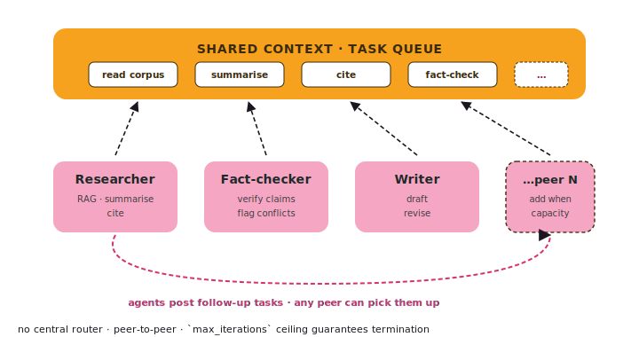

# Swarm

A swarm is a peer-to-peer task pool. Agents pull tasks off a shared
queue, run them, and may post follow-up tasks for any peer to pick up.
**Nobody is in charge.**

{ .diagram }

## What it is

Three pieces:

- A **`SharedContext`** — a dict every agent reads and writes.
- A **task queue** — agents pull from it; agents push to it.
- N **agents** — each with its own tools and system prompt.

Each iteration, every available agent picks the next task it's
qualified for, runs it, and may emit follow-up tasks. The swarm
exits when the queue empties or `max_iterations` is hit.

## When to use it

- ✅ **Open-ended research** — no fixed plan; whatever an agent finds
  may spawn new sub-tasks.
- ✅ **Heterogeneous specialists** — each agent has different tools
  but any of them can pick up the next task they're qualified for.
- ✅ **Long-running batch** — a queue depth + a max-iteration budget
  is the natural shape.
- ✅ **No single coordinator should exist** — peer-to-peer is the
  point.

## When NOT to use it

- ❌ The flow is actually **linear** → use [Composition](composition.md).
- ❌ One agent should **decide** who runs → use [Orchestrator](orchestrator.md).
- ❌ The **conversation transcript** should follow one role to another → use [Handoff](handoff.md).
- ❌ You need **strict execution order** — swarms run agents concurrently
  by design.

## Code

```python
from tulip.multiagent import Swarm

researcher = Agent(
    model="anthropic:claude-sonnet-4-6",
    tools=[search_corpus, summarise],
    system_prompt="You are a researcher. Read, summarise, post follow-ups.",
)
fact_checker = Agent(
    model="anthropic:claude-sonnet-4-6",
    tools=[verify_claim, search_corpus],
    system_prompt="You are a fact-checker. Verify claims, flag conflicts.",
)
writer = Agent(
    model="anthropic:claude-sonnet-4-6",
    tools=[draft, revise],
    system_prompt="You are a writer. Take vetted summaries, draft prose.",
)

swarm = Swarm(
    agents=[researcher, fact_checker, writer],
    shared_context={"topic": "Q3 launch", "audience": "exec summary"},
    max_iterations=12,
    initial_tasks=["read corpus", "summarise top sources"],
)

result = swarm.run_sync()
print(result.final_artefact)
```

## How agents post follow-up tasks

Each agent's tool surface includes (implicitly) a `post_task(...)`
mechanism. When an agent finishes, it can append new tasks to the
shared queue:

```python
# inside a tool the agent calls
@tool
def summarise_and_followup(text: str, ctx: ToolContext) -> dict:
    summary = summarise(text)
    if has_uncited_claims(summary):
        ctx.swarm.post_task(f"verify claims in: {summary[:200]}…")
    return {"summary": summary}
```

The next iteration, any qualifying agent (here — the fact-checker)
picks up that task.

## Termination

Swarms stop when:

- The queue empties **and** no agent emits new tasks, OR
- `max_iterations` is hit, OR
- A custom `terminate` condition matches (the swarm honours
  [Termination algebra](../termination.md) the same way an `Agent` does).

## Notebook

[`notebook_24_swarm_multiagent.py`](https://github.com/tuliplabs-ai/sdk-python/blob/main/examples/notebook_24_swarm_multiagent.py)
— a three-agent research swarm with shared context.

## Source

[`multiagent/swarm.py`](https://github.com/tuliplabs-ai/sdk-python/blob/main/src/tulip/multiagent/swarm.py)
— `Swarm`, `SharedContext`.

## See also

- [Multi-agent overview](../multi-agent.md) — pick a shape.
- [Orchestrator](orchestrator.md) — when you DO want a router.
- [Termination](../termination.md) — composable stop conditions.
