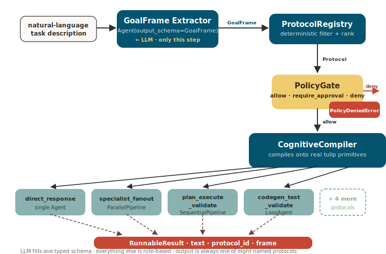

# Router — pick the orchestration shape from a natural-language task

You hand the router a sentence like *"Diagnose the checkout API
slowdown."* It picks one of eight orchestration shapes — direct answer,
plan-execute-validate pipeline, parallel specialist fan-out, debate,
code-gen-with-tests loop, approval-gated execution, handoff chain, or
remote A2A delegation — and runs that shape against your tools.

You describe *what* you want; the router decides *how* to coordinate
the agents. The LLM only fills a typed schema (a `GoalFrame`) — it
never authors the topology. Selection, ranking, and policy are pure
Python over that frame, so two identical requests always produce the
same shape.

Under the hood: `tulip.router` is a meta-orchestration layer on top of
Tulip's existing primitives. It
compiles the chosen shape onto a real `Agent`, `SequentialPipeline`,
`ParallelPipeline`, `LoopAgent`, or `Orchestrator` from the standard
toolkit. The contribution is the *layer*, not the primitives — every
router execution is just a normal SDK orchestration you can already
inspect, replay, and extend.

## Why a routing layer

Frameworks tend to pick one extreme:

- **LangGraph** — you author the topology by hand. Predictable, but
  every new shape is more code.
- **CrewAI / free-form agent swarms** — the LLM picks the topology. As
  flexible as the model, as fragile as the model.

`tulip.router` splits the difference: the LLM produces *only* a typed
`GoalFrame`; the rest of the pipeline is rule-based. You get adaptive
routing without giving the model the steering wheel.

## The five layers

A dispatch flows through five stages, in order: an LLM extractor reads
the prompt into a typed `GoalFrame`, the protocol registry picks the
matching shape, the policy gate decides whether the request is allowed
(and whether it needs approval), the compiler instantiates the real
SDK primitive, and the runnable executes. Every stage except the
first is pure Python.



### 1. GoalFrame — the typed contract

```python
from tulip.router import Complexity, GoalFrame, Risk, TaskType

frame = GoalFrame(
    primary_goal=TaskType.DIAGNOSE,
    domain="observability",
    complexity=Complexity.HIGH,
    risk=Risk.MEDIUM,
    required_capabilities=["metric_probe", "alert_list"],
)
```

The LLM extractor — a standard SDK
`Agent(model=..., output_schema=GoalFrame)` — fills exactly this
schema. It does *not* author orchestration topology.

### 2. Protocol Registry — typed selection

```python
from tulip.router import ProtocolRegistry, builtin_protocols

protocols = ProtocolRegistry()
protocols.register_many(builtin_protocols())

chosen = protocols.select(frame, available_capabilities={"metric_probe", "alert_list"})
# chosen.id == "specialist_fanout"
```

Selection filters on `handles ∋ primary_goal`,
`risk_max ≥ frame.risk`, and `requires_capabilities ⊆ available`,
then ranks candidates by complexity-fit + cost. It never asks the LLM.

### 3. CapabilityIndex — view over `ToolRegistry`

```python
from tulip.router import CapabilityIndex
from tulip.tools.registry import create_registry

tools = create_registry(kb_search, get_metric, list_alerts)
caps = CapabilityIndex(tools)
caps.annotate(
    "metric_probe",
    tool_name="get_metric",
    description="Latest value for a named metric.",
    domain="observability",
)
```

The index is an **overlay**, not a parallel registry — the underlying
`Tool` still lives in `ToolRegistry`. Capabilities just add the
domain + risk metadata that the router needs.

### 4. PolicyGate — risk + approval

```python
from tulip.router import PolicyGate, Risk

gate = PolicyGate(
    max_risk=Risk.HIGH,                # nothing above HIGH allowed
    require_approval_above=Risk.MEDIUM,  # HIGH-risk frames need approval
)
verdict = gate.check(frame, chosen)
# verdict.allow / verdict.require_approval / verdict.reason
```

The gate produces one of three verdicts. Approval-flagged runnables
are wrapped with a callback that the workbench's interrupt UI (or your
own approval flow) can drive.

### 5. CognitiveCompiler — composition, not codegen

```python
from tulip.router import CognitiveCompiler, Router

compiler = CognitiveCompiler(
    protocols=protocols,
    capabilities=caps,
    policy=gate,
    model=model,
)
router = Router(extractor=extractor, compiler=compiler)
result = await router.dispatch("Diagnose the checkout slowdown.")
print(result.protocol_id, result.text)
```

The compiler instantiates a real SDK primitive and wraps it in a
`Runnable` adapter so call sites get a single shape
(`async execute(task) -> RunnableResult`) regardless of which protocol
fired.

## Built-in protocols

The eight builtins span the cardinal orchestration shapes.
`primary_for` (a strict subset of `handles`) names the task types each
protocol is the **canonical** choice for — that flag breaks ties in
the registry's ranking.

| `Protocol.id` | Compiled shape | `handles` | `primary_for` |
|---|---|---|---|
| `direct_response` | `Agent` (single call) | `ANSWER`, `EXPLAIN`, `RESEARCH` | `ANSWER`, `EXPLAIN` |
| `plan_execute_validate` | `SequentialPipeline([planner, executor, validator])` | `PLAN`, `BUILD`, `MODIFY`, `GENERATE_CODE`, `REMEDIATE` | `PLAN`, `BUILD`, `MODIFY` |
| `specialist_fanout` | `ParallelPipeline` of N tool-bound `Agent`s | `DIAGNOSE`, `COMPARE`, `MONITOR`, `COORDINATE`, `RESEARCH` | `DIAGNOSE`, `MONITOR`, `RESEARCH` |
| `debate` | `ParallelPipeline` of 2 debaters + a judge `Agent` | `COMPARE`, `RESEARCH` | `COMPARE` |
| `codegen_test_validate` | `LoopAgent` (stops on `PASS`) | `GENERATE_CODE`, `BUILD` | `GENERATE_CODE` |
| `approval_gated_execution` | Single `Agent` wrapped in an approval interrupt | `REMEDIATE`, `MODIFY`, `ESCALATE` | `ESCALATE`, `REMEDIATE` |
| `a2a_delegate` | `A2AClient.invoke` against a remote endpoint | `COORDINATE`, `ESCALATE` | *(opt-in only)* |
| `handoff_chain` | `SequentialPipeline` of one-tool `Agent`s | `PLAN`, `RESEARCH`, `COORDINATE` | `COORDINATE` |

Note: the `specialist_fanout` and `handoff_chain` builders use real
`Agent` instances (not the native `Specialist` / `HandoffAgent`)
because those primitives execute a single `model.complete()` and don't
loop on tool calls — so models that say "I'll call the tool" never
actually invoke it. The `Agent` loop runs the full tool cycle.

## Ranking — how the registry picks one protocol

Filtering by `handles` and `risk_max` usually leaves several protocols
on the table. The registry then ranks them on four signals — lower
wins at each — and picks the first survivor. The intuition: prefer a
protocol whose cost matches the request's complexity, prefer one
that's canonical for the goal type, prefer cheaper over more
expensive, and break ties on specificity.

`_rank_key` layers the four signals (lower wins each layer):

1. **Distance** — how close the protocol's `cost` matches `frame.complexity`. A LOW-complexity request never gets a HIGH-cost protocol just because that protocol claims to be canonical for the goal type.
2. **Canonical** — `0` if `frame.primary_goal in protocol.primary_for`, else `1`. Breaks distance ties: when two protocols both fit the complexity, the one designed for the specific goal wins.
3. **Cost** — lower-cost protocols win at the next tier.
4. **Handles count** — fewer = more specific; final tiebreaker.

## Emergent picker — opt-in second mode

The default ranker is rule-based and deterministic. When the rule
hierarchy doesn't capture your deployment's actual fit — typically
when you register custom protocols alongside the built-ins — pass an
`LLMProtocolPicker` to the compiler and the model picks the
protocol instead.

```python
from tulip.router import (
    CognitiveCompiler, LLMProtocolPicker, PolicyGate, ProtocolRegistry,
    builtin_protocols, CapabilityIndex,
)

picker = LLMProtocolPicker(model=model)
compiler = CognitiveCompiler(
    protocols=registry,
    capabilities=capabilities,
    policy=PolicyGate(),
    model=model,
    protocol_picker=picker,   # opt-in — default is None (rule-based)
)
```

The picker is strictly scoped to the disambiguation step. The
compiler still:

1. **Filters candidates** by `handles`, `risk_max`, and
   `requires_capabilities` *before* the picker sees anything — the
   model never picks an ineligible protocol.
2. **Short-circuits** when one candidate survives — no LLM call.
3. **Falls back** to `_rank_key` if the picker raises or returns an
   unknown id; emits `router.protocol.picker_fallback` so the
   degradation is observable. Emergent mode never reduces
   availability.
4. **Runs PolicyGate** after the pick. Same risk/approval gating
   regardless of who picked.

Every `router.protocol.selected` event carries a `method` field
identifying which path produced the pick:

| `method` | When |
|---|---|
| `"rule_based"` | Default `_rank_key` path (picker not configured) |
| `"single_candidate"` | One candidate survived filtering; picker bypassed |
| `"llm_picked"` | Picker resolved the disambiguation; `rationale` field populated |
| `"rule_based_fallback"` | Picker raised or hallucinated; `_rank_key` resolved it |

See [notebook 59](../notebooks/notebook_34_emergent_routing.md) for a
runnable side-by-side comparison.

## Skills integration

Skills (`SKILL.md` packages following the
[AgentSkills.io](https://agentskills.io) spec) attach to every Agent
the compiler emits, scoped to `frame.domain`. The agent's
`SkillsPlugin` does the L1 / L2 / L3 progressive disclosure at
runtime — the catalog appears in the system prompt; the agent calls
the `skills` tool to load full instructions.

```python
from tulip.router import SkillIndex
from tulip.skills import Skill

skills = SkillIndex()
for s in Skill.from_directory("./examples/skills"):
    # Tag each skill with the domain it applies to. Skills registered
    # without a domain ("global") appear in every domain's catalog.
    skills.register(s, domain=s.metadata.get("domain", ""))

compiler = CognitiveCompiler(
    protocols=protocols,
    capabilities=caps,
    policy=gate,
    model=model,
    skills=skills,
)
```

When a user dispatches a request with `domain="observability"`, every
emitted Agent (planner / executor / validator for
`plan_execute_validate`; each fan-out leg for `specialist_fanout`;
etc.) sees the observability-tagged skills catalog and can activate
any one of them on demand.

## A2A delegation

`a2a_delegate` is the only builtin protocol that's **opt-in only**:
its `primary_for` list is empty, so the registry never picks it
canonically. To enable it, configure the remote endpoint at compile
time:

```python
compiler = CognitiveCompiler(
    protocols=protocols,
    capabilities=caps,
    policy=gate,
    model=model,
    a2a_endpoint="https://remote-agent.example.com",
)
```

The compiler passes the endpoint into `BuilderContext`; the builder
constructs an `A2AClient` and wraps it in an `A2ARunnable`. Without an
endpoint, picking the protocol raises `RuntimeError` — the registry
won't reach that path under default ranking.

## Custom protocols

Build your own by writing a builder function and registering it:

```python
from tulip.router import Protocol, TaskType, Risk

def _my_builder(frame, capabilities, ctx):
    ...  # return a Runnable
    return wrap_pipeline(my_pipeline, "my_protocol", frame)

protocols.register(
    Protocol(
        id="my_protocol",
        description="...",
        handles=[TaskType.RESEARCH],
        risk_max=Risk.MEDIUM,
        builder=_my_builder,
    )
)
```

The same `Router` instance can serve multiple domains (observability,
codegen, support) by swapping `CapabilityIndex` content — protocols
themselves are domain-agnostic.

## Error handling

Three exception types can propagate out of `router.dispatch()`. Handle
all three at the call site:

```python
from tulip.router.runtime import FrameExtractionError
from tulip.router.protocol import NoMatchingProtocolError
from tulip.router.policy import PolicyDeniedError

try:
    result = await router.dispatch(user_input)
except FrameExtractionError as e:
    # The extractor's output failed GoalFrame schema validation.
    # Retry with a better system prompt or a stricter model.
    logger.warning("frame extraction failed: %s", e)
except NoMatchingProtocolError as e:
    # No protocol in the registry survived the filter pass
    # (handles ∌ primary_goal, risk_max too low, or missing capabilities).
    # Register a new protocol or broaden an existing one.
    logger.warning("no matching protocol: %s", e)
except PolicyDeniedError as e:
    # The PolicyGate returned `deny` — frame.risk exceeded max_risk.
    # Escalate to a human or reject the request.
    logger.error("policy denied: %s", e)
```

## Observability

Every `router.dispatch()` call emits a complete SSE trace on the in-process
`EventBus` when a `run_context` is active. Subscribe before dispatching to
watch the full pipeline in real time:

```python
from tulip.observability import run_context, get_event_bus

async with run_context() as rid:
    sub = asyncio.create_task(_print_events(rid))
    result = await router.dispatch("Diagnose the checkout slowdown.")
    await sub

async def _print_events(rid):
    async for event in get_event_bus().subscribe(rid):
        print(f"{event.event_type}: {event.data}")
```

Events emitted (in order):

| `event_type` | When |
|---|---|
| `router.frame.extracted` | GoalFrame extracted successfully |
| `router.frame.failed` | Schema validation failed |
| `router.protocol.selected` | Registry picked a protocol |
| `router.protocol.no_match` | No protocol survived filter |
| `router.policy.verdict` | Gate returned allow / require_approval / deny |
| `router.runnable.compiled` | Compiler emitted a Runnable |
| `router.runnable.executing` | Runnable started |
| `router.runnable.executed` | Runnable finished successfully |
| `router.runnable.failed` | Runnable raised |

See [SSE event catalogue](sse-events.md) for full payload field descriptions
(search for the `router.*` section).

## See also

- Notebook: [`examples/notebook_58_cognitive_router.py`](https://github.com/tuliplabs-ai/sdk-python/blob/main/examples/notebook_58_cognitive_router.py)
- [SSE event catalogue](sse-events.md) — `router.*` event payloads.
- [Observability](observability.md) — `run_context`, `EventBus`, EventBusHook.
- API reference: `tulip.router` (`GoalFrame`, `Protocol`,
  `ProtocolRegistry`, `PolicyGate`, `CognitiveCompiler`, `Router`,
  `RunnableResult`).
