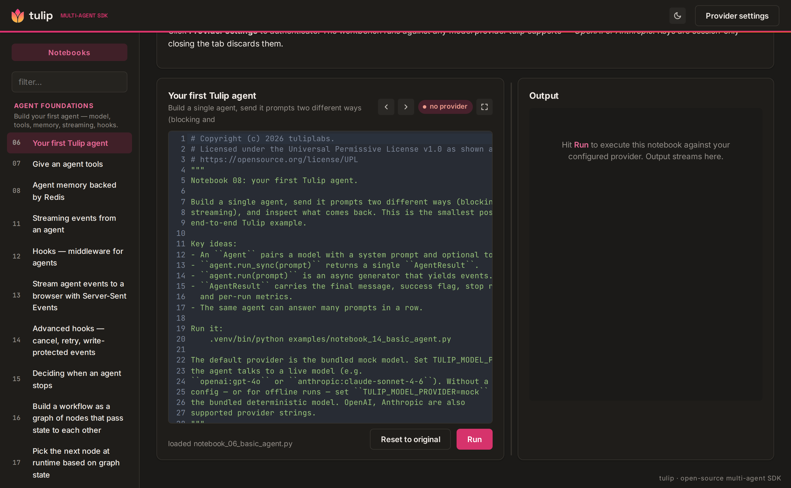

<p class="tulip-product-name">Multi-Agent SDK</p>

# Workbench

A browser-based playground for every Tulip SDK pattern. Two ways to
run it — straight from source on your laptop, or inside a Docker
container — both end at the same UI at <http://localhost:5173>.

[View on GitHub](https://github.com/tuliplabs-ai/sdk-python){ .md-button .md-button--primary }
[Workbench README](https://github.com/tuliplabs-ai/sdk-python/tree/main/workbench){ .md-button }

Once it's up: open *Provider settings*, paste an OpenAI / Anthropic
key, choose a notebook in the
sidebar, hit **Run**. A real agent streams events back into the
browser.



## What it is

The workbench is the fastest way to *see* what the Tulip SDK does
without installing anything locally. It's a single-page UI in front of
every canonical Tulip pattern — a basic agent, an agent with tools, a
structured-output schema, an orchestrator with specialists, a
sequential pipeline, a map-reduce fan-out, a critic loop with
`allow_cycles`. Each pattern is wired to a real Python coroutine
that imports the SDK, builds the agent, and streams events through to
your browser.

### Start with the foundations

The catalog leads with the **Agent Foundations** category — a basic
agent, an agent with tools, conversation memory, streaming, and
lifecycle hooks. Pick any one, hit **Run**, and watch the typed event
stream render live.

The notebook sidebar surfaces the full learning path: graphs &
composition, multi-agent shapes, reasoning, RAG, skills/plugins,
production patterns, and end-to-end workflows.

It's also the canonical demo: visitors arrive at this app, pick a
workflow, and learn the SDK by running real ones.

```
┌───────────────────────────────────────┐
│  workbench/web   — vanilla TS + Vite  │  :5173
│  Notebook catalog · provider settings │
└───────────────────┬───────────────────┘
                    │ /api/*
                    ▼
┌───────────────────────────────────────┐
│  workbench/bff   — Node Express       │  :3101
│  Same-origin proxy + cookie surface   │
└───────────────────┬───────────────────┘
                    │ /api/*
                    ▼
┌───────────────────────────────────────┐
│  workbench/backend — FastAPI runner   │  :8100
│  One endpoint per tulip pattern       │
└───────────────────────────────────────┘
```

You paste your provider key once per tab — **the workbench never
persists API keys to localStorage**, so closing the tab discards
everything.

## Run it locally (from source)

The dev-loop path. Best for iterating on the workbench code itself,
debugging a pattern, or extending the runner.

### Prerequisites

- **Python 3.11+** with `pip` (3.12 is what CI uses).
- **Node 20+** with `npm`.
- A model provider — one of: an `OPENAI_API_KEY`, an
  `ANTHROPIC_API_KEY`.

### Step-by-step

```bash
git clone https://github.com/tuliplabs-ai/sdk-python.git
cd tulip
pip install -e ".[server,openai,anthropic]"  # core + provider extras
```

Three tiers, three terminals (or three tmux panes). They don't depend
on each other at startup, but every tier expects the one downstream
of it to come up within ~30 s:

```bash
# Terminal 1 — FastAPI runner (the actual workbench backend)
cd workbench/backend
python -m uvicorn --app-dir . runner:app --port 8100

# Terminal 2 — Express BFF (proxies /api/* from the web tier to the runner)
cd workbench/bff
npm install
npm run dev                                       # binds :3101

# Terminal 3 — Vite dev server (the UI)
cd workbench/web
npm install
npm run dev                                       # binds :5173
```

Or use the convenience `Makefile`:

```bash
cd workbench
make install                                      # npm install in bff + web
make backend                                      # pane 1 — :8100
make bff                                          # pane 2 — :3101
make web                                          # pane 3 — :5173
```

`make install` also runs `npx playwright install chromium` for the
end-to-end test suite in `workbench/e2e/`. The `make backend` target
is the workbench runner — distinct from `make backend-research` and
`make backend-finance`, which spin up the A2A mesh demo peers for
[notebook 28](notebooks/notebook_28_a2a_protocol.md), not the
workbench.

### Verify it's up

```bash
curl -s http://127.0.0.1:8100/api/health | jq        # runner
curl -s http://127.0.0.1:3101/api/health | jq        # bff
curl -sI http://127.0.0.1:5173/ | head -1            # web → HTTP/1.1 200 OK
```

Then open <http://localhost:5173>. Click **Provider settings** (top
right), pick your provider, fill the credentials, hit Save. Pick a
notebook from the sidebar, hit **Run**.

## Run it in Docker

The packaged path. Best for handing the workbench to a teammate, a
new laptop, or a demo machine where you don't want to install the
Python and Node toolchains directly.

### Build

```bash
git clone https://github.com/tuliplabs-ai/sdk-python.git
cd tulip
docker build -t tulip-workbench -f workbench/Dockerfile .
```

Image is ~1.3 GB on first build (slim Python 3.12 base + Node 20 + the
SDK + workbench source). Subsequent builds hit the BuildKit layer
cache.

### Run

For **OpenAI / Anthropic** providers — paste the key into *Provider
settings* once the UI is up. Nothing extra to pass to the container:

```bash
docker run --rm -p 5173:5173 -p 3101:3101 -p 8100:8100 tulip-workbench
# open http://localhost:5173
```

### Port collisions

If 5173 / 3101 / 8100 are taken on the host (you have the local
workbench running, for instance), remap them:

```bash
docker run --rm \
  -p 5273:5173 -p 3201:3101 -p 8200:8100 \
  tulip-workbench
# then http://localhost:5273
```

The container ports stay 5173/3101/8100 — only the host-side port
changes. The Vite dev server inside the container always listens on
5173; remapping doesn't break the BFF→backend or web→BFF wiring.

Stop with `Ctrl-C`; `--rm` removes the container on exit.

## Provider settings

The header's **Provider settings** modal accepts two shapes:

- **OpenAI** — paste `sk-…` + pick a model (defaults to `gpt-4o`).
- **Anthropic** — paste `sk-ant-…` + pick a model
  (defaults to `claude-sonnet-4-6`).

Settings live in the page's memory. Closing the tab discards them.
Reopening the page = paste again. This is intentional: an API key
sitting in `localStorage` on a shared computer is a leak waiting to
happen.

## What you can run

The catalog populates from the BFF's `/api/notebooks` endpoint
(aliased to `/api/notebooks` for backwards compatibility), which
walks `examples/notebook_*.py`. As of writing the workbench has 9
dedicated FastAPI pattern endpoints:

| Pattern | What it shows |
|---|---|
| Basic agent | One-shot Q&A — hello world for the SDK |
| Agent + tools | ReAct loop with `add` and `reverse` tools |
| Structured output | `output_schema=Verdict` → typed Pydantic result |
| Orchestrator + specialists | Coordinator dispatches to researcher + editor |
| Sequential composition | Two agents chained: researcher → summariser |
| Map-reduce code review | Fan-out to 3 reviewers, reduce findings |
| StateGraph critic loop | Writer → Critic cycle with `allow_cycles` |
| **Long-term memory** | Two-session demo — see below |
| **Cognitive routing** | Rule-based vs LLM-picker selection — see below |

The rest run as plain Python subprocesses against your provider —
same behaviour as running the notebook from a terminal, just inside
the workbench so you can watch streamed events instead of tailing
stdout.

Notebook 29 (DeepAgent) ships a `part5_datastores` section that
exercises `create_deepagent(datastores={"medical": …})` against an
in-memory `RAGRetriever`. The same auto-wiring backs the
[deep-research project examples][dr] — runnable demos that swap the
in-memory store for OpenSearch (or any other Tulip vector store).
The workbench surfaces the in-memory variant in the sidebar; the
multi-backend versions live as standalone project demos in
`examples/projects/deep-research/`.

[dr]: https://github.com/tuliplabs-ai/sdk-python/tree/main/examples/projects/deep-research

### Long-term memory pattern

Pick **Long-term memory** in the sidebar and paste a prompt that
reveals something about yourself — your role, a preference, a
constraint. The workbench runs two back-to-back agent sessions:

**Session 1** processes your prompt and runs LLM-backed extraction to
identify durable facts worth keeping. Those facts are persisted to an
in-memory store (scoped to the request; cleared between runs).

**Session 2** is a fresh agent with no conversation history — only
the injected `[Long-term Memory]` block. It answers "What do you know
about me?" using only what was stored, demonstrating cross-session
recall without passing any raw history.

Sample prompts that produce interesting memory extraction:

```
I'm a senior Python engineer working on a compliance-driven auth rewrite.
I prefer short answers and always want real database connections in tests —
no mocks. Can you explain JWT vs session tokens briefly?
```

```
I'm a data scientist focused on model evaluation. I work in Python and use
PostgreSQL for storage. The project deadline is end of Q2. What's a good
evaluation metric for imbalanced classification?
```

The reply shows three sections: the Session 1 answer, the extracted
memories (key/content pairs), and the Session 2 recall — so you can
see exactly what the model chose to remember and how it surfaced in a
fresh context.

### Cognitive routing pattern

Pick **Cognitive routing** in the sidebar and you'll see a
**Selection mode** segmented control above the Run button:

- **Rule-based** (default) — `ProtocolRegistry.select()` →
  deterministic `_rank_key` tuple comparison. Auditable,
  reproducible, free of model latency.
- **LLM picker** (opt-in) — `LLMProtocolPicker` lets the model
  pick the protocol from the filtered candidate set. PolicyGate,
  capability binding, and the candidate filter all stay rule-based;
  only the disambiguation step moves to the model.

Hit Run and the workbench shows a chip with the dispatched
`protocol_id` plus a `method` badge (`rule_based` /
`single_candidate` / `llm_picked` / `rule_based_fallback`). When
LLM-picker mode dispatched the run, the model's one-sentence
rationale renders as a callout above the reply text — the same
field the `router.protocol.selected` SSE event carries.

Sample prompts that exercise different protocols:

```
What does the router do in the context of this SDK?
→ direct_response
```

```
Compare swarm vs orchestrator patterns for open-ended research.
→ debate (LLM picker may differ from the rule-based ranker)
```

```
Diagnose the checkout API latency spike: pull metrics, list alerts,
correlate findings.
→ specialist_fanout
```

See [notebook 34](notebooks/notebook_34_emergent_routing.md) for the
full code path and [concepts/router.md](concepts/router.md#emergent-picker-opt-in-second-mode)
for the architectural details.

## Cost

**You pay $0 to run the workbench itself.** All three tiers run
locally — your laptop or your Docker daemon. The only thing you pay
for is the model calls your notebooks make, and those go directly
to *your* provider key (OpenAI / Anthropic).

## Troubleshooting

- **Sidebar is empty** — the BFF couldn't reach the backend. The
  runner takes 10–20 s to start; reload the page once you see
  `Uvicorn running on http://0.0.0.0:8100` in the backend logs
  (or `docker logs <container>` for the Docker path).
- **"Provider settings: setup required" never goes away** — you
  closed the modal without hitting Save. Reopen and click Save.
- **OpenAI / Anthropic auth fails** — double-check the API key in
  *Provider settings*. Keys are session-only; reopening the page means
  pasting again.
- **Notebook fails with "no parsed Pydantic" / empty output** — your
  model is too small for structured output. Use `gpt-4o` or
  `claude-sonnet-4-6` for the demos that use `output_schema`.
